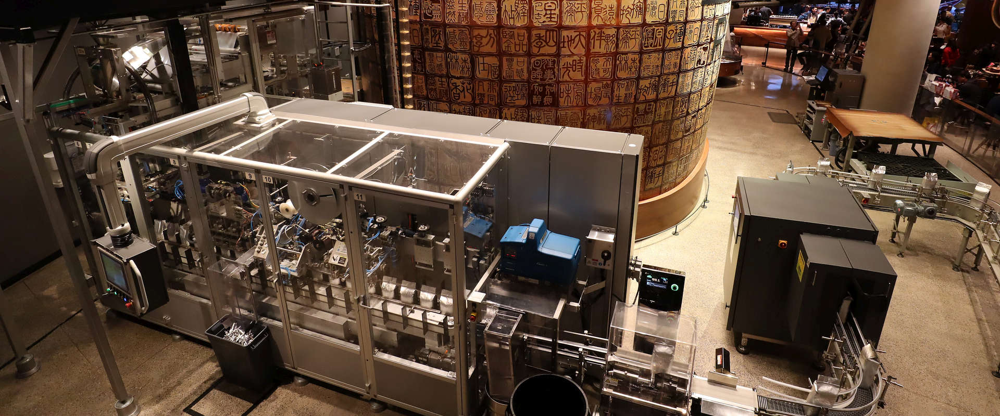
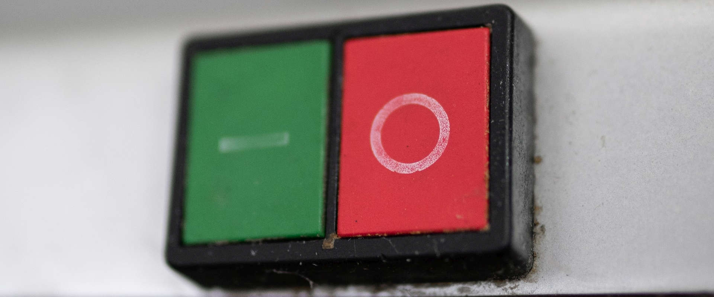
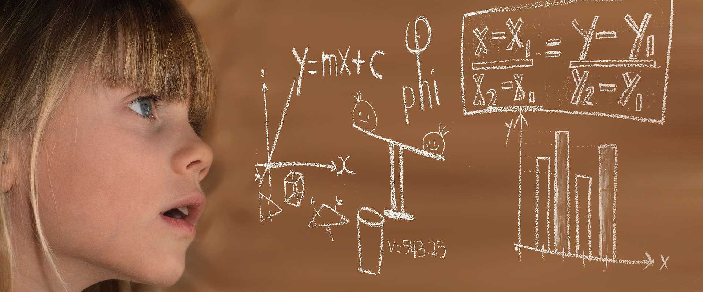

# Blog

## Website ArtBodenleger – artbodenleger.de

by [ionutojicawp](https://ionutojica.ro/author/ionutojicawp/) | 13 October 2025 | [Uncategorized](https://ionutojica.ro/category/uncategorized/)

🔹 Context & Obiectiv În perioada 30 august – 10 octombrie 2025, am dezvoltat website-ul ArtBodenleger — un proiect complet de la idee până la lansare, creat pentru un antreprenor individual din Germania.Scopul principal: construirea unui portofoliu vizual clar,...

## Mautic şi marcarea email-urilor ca SPAM

by [ionutojicawp](https://ionutojica.ro/author/ionutojicawp/) | 2 April 2023 | [Mautic](https://ionutojica.ro/category/mautic/)

Eu personal simt că primesc prea multe email-uri pe zi. Dacă le-aş număra presupun că sunt 10, în afara celor legate de Excel sau de acest site. Majoritatea email-urilor (încă mai) ştiu de ce le primesc. Sunt însă puţine email-uri ... nu-mi aduc aminte să le fi cerut!...

## Ce sunt email-urile de pescuit? (phishing)

by [ionutojicawp](https://ionutojica.ro/author/ionutojicawp/) | 1 April 2023 | [Securitate](https://ionutojica.ro/category/securitate/)

Dacă ştii cum să detectezi email-urile de pescuit, atunci înseamnă că analizezi link-urile din orice email înainte de a-l accesa. Numite phishing emails pe engleză, ele sunt email-uri de la persoane rău intenţionate, care se dau drept cunoscuţi ţie. Trebuie să ştii că...

## Newslettere. Emailuri. Dezabonare.

by [ionutojicawp](https://ionutojica.ro/author/ionutojicawp/) | 1 April 2023 | [Mautic](https://ionutojica.ro/category/mautic/)

Am adresa ta de email şi primeşti email-uri de la mine? Citeşte mai jos să vezi de ce. Atunci când ai introdus adresa ta de email pentru a primi: materialul video gratuit prin care îţi arăt cum am tradus o subtitrare din engleză în română folosindu-mă de Excel pe...

## Programe Open-Source gratuite de automatizare

by [ionutojicawp](https://ionutojica.ro/author/ionutojicawp/) | 25 January 2023 | [Mautic](https://ionutojica.ro/category/mautic/)

Tocmai am citit următoarea pagină câteva programe open-source gratuite super - în ce priveşte automatizarea marketingului online, eu tot Mautic îl găsesc ok, chiar dacă este încă în dezvoltare şi îi lipseşte unele fundiţe şi năsturei la câteva unelte....

## O idee şi presupunerea că Excel mă poate ajuta

by [ionutojicawp](https://ionutojica.ro/author/ionutojicawp/) | 8 December 2022 | [Excel](https://ionutojica.ro/category/excel/)

Cum încep eu un document Excel? Azi îţi voi spune o poveste. O poveste critică. Poate fi motivator pentru începătorii de Excel. Presupunem că am o idee simplă şi presupunerea că Excel m-ar putea ajuta. Da, doar presupunerea că Excel mă poate ajuta este de ajuns....

## Documente Excel deschise la fiecare pornire a Excel-ului

by [ionutojicawp](https://ionutojica.ro/author/ionutojicawp/) | 24 November 2022 | [Excel](https://ionutojica.ro/category/excel/)

Ai documente pe care doreşti să le ai deschise de fiecare dată când porneşti Excel? Poţi adăuga acele documente într-unul din dosarele StartUp ale Excel. Toate documentele ce sunt în aceste documente vor fi deschise de Excel când porneşte. Dosarele sunt:1.C:\Program...

## Documente imense şi complexe în Excel, dar utile ! Fără funcţii volatile!

by [ionutojicawp](https://ionutojica.ro/author/ionutojicawp/) | 11 November 2022 | [Excel](https://ionutojica.ro/category/excel/)

Azi am reuşit din nou să întorc Excel-ul cu capul în jos 🤯 A fost o provocare de mai bine de 5 ani, timp în care am lăsat ideea să fermenteze… ca să zic aşa. Şi în ultimele 2 zile am finalizat-o cu succes. Nu o să puteţi ghiciţi despre ce este vorba, nici după 1000 de...

## Dacă … atunci … în Excel este IF()

by [ionutojicawp](https://ionutojica.ro/author/ionutojicawp/) | 2 November 2022 | [Excel](https://ionutojica.ro/category/excel/)

Cum ar fi fără funcţia dacă ... atunci ... ? Ce-ar fi un program în care nu ai avea posibilitatea să faci diferite acţiuni în funcţie de o condiţie !? Dacă ... atunci ...Este de neconceput. Aşa se comportă un calculator de birou - totul trebuie să gândeşti tu: dacă...

## Formule în Excel – de ce Formule şi nu funcţii?

by [ionutojicawp](https://ionutojica.ro/author/ionutojicawp/) | 1 November 2022 | [Excel](https://ionutojica.ro/category/excel/)

Are cuvântul funcții la tine un sens negativ? Şi eu sunt printre cei care nu înţelegem funcţii. Să fie acesta motivul pentru care în Excel avem FORMULE ?
