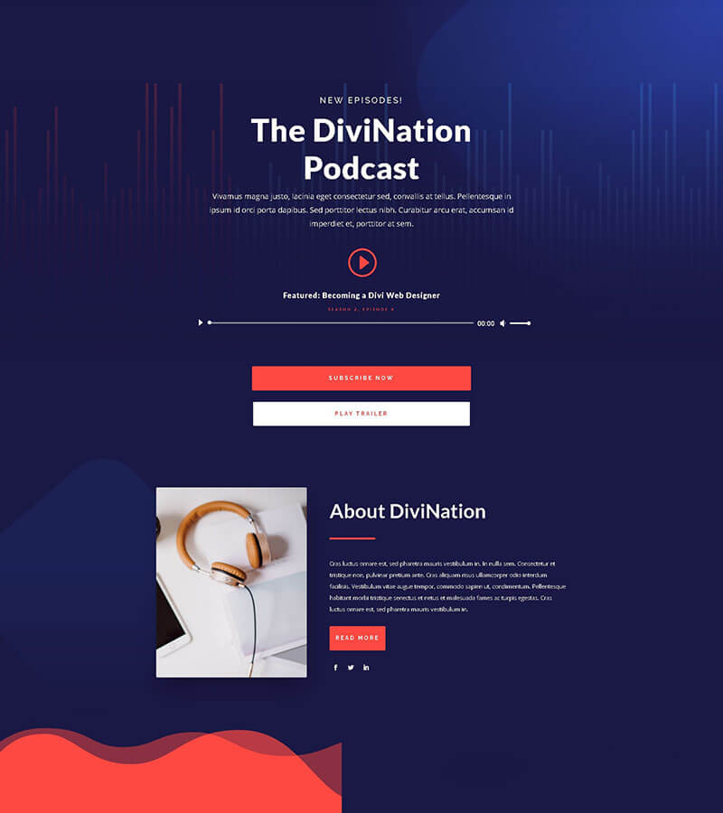
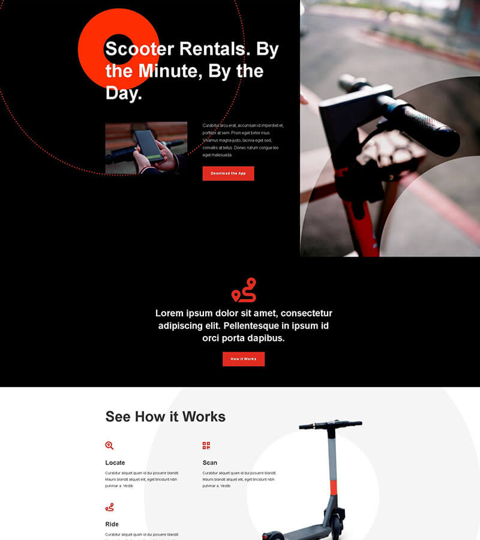
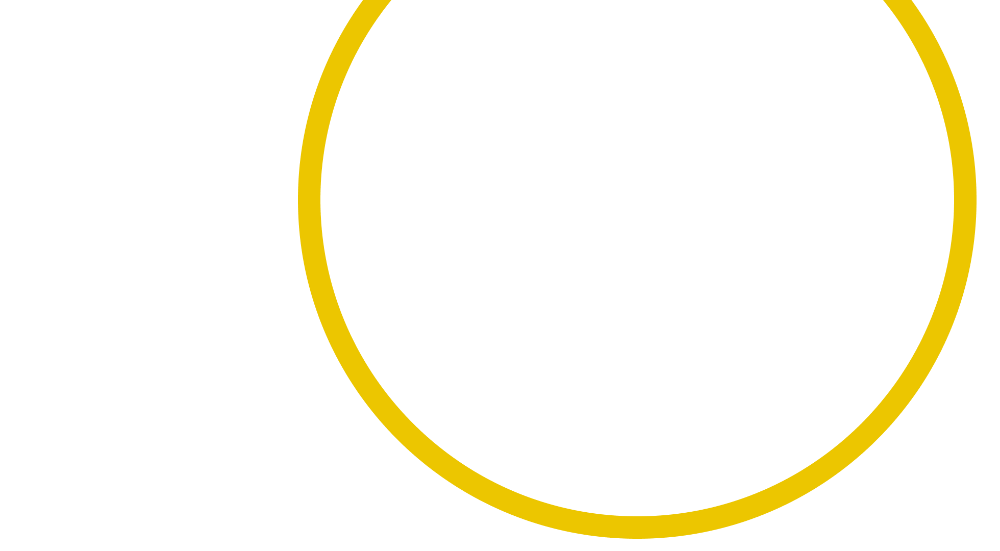
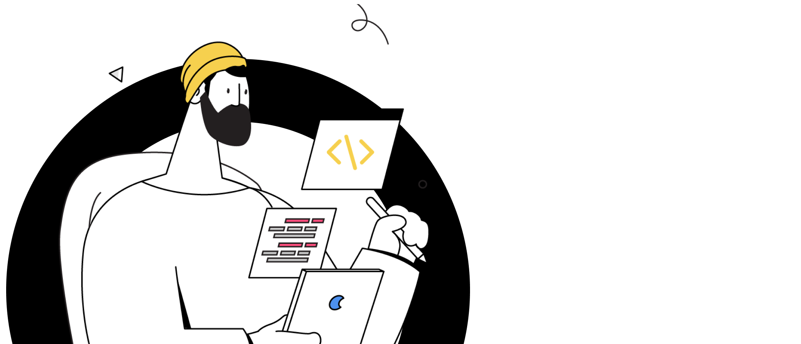
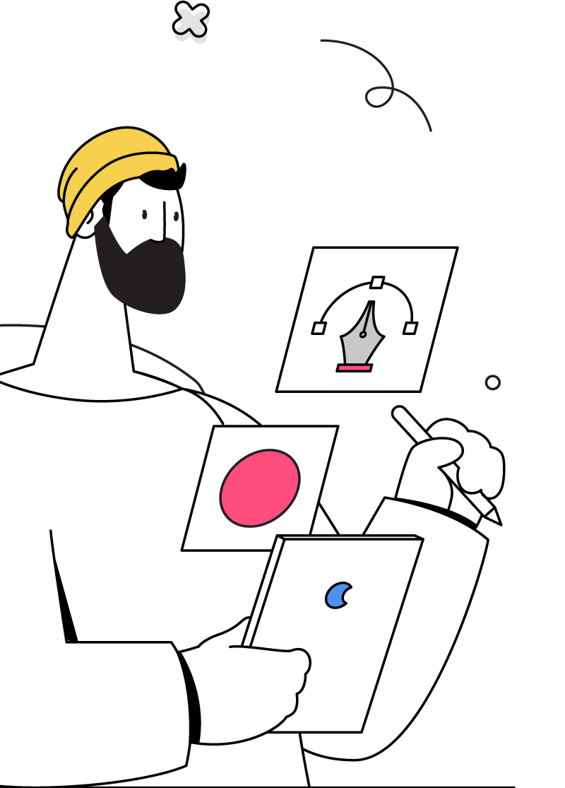

# Platforma ta de cursuri online, fără dureri de cap tehnice

### Ai deja un site, poate chiar conținutul pentru primul curs. Dar nu știi ce să alegi, cum să-l instalezi, sau de unde să începi. Între timp, timpul trece… și cursul tău rămâne offline.

### Sună cunoscut?

- Am site, dar nu știu unde să pun cursul.
- Am auzit de LearnDash, dar pare complicat.
- Mi-e teamă că site-ul se blochează dacă instalez prea multe.
- Aș vrea să vând cursuri, dar n-am timp să învăț toate setările.
- Am încercat să fac singur… și am renunțat.

# Fără bătăi de cap. Doar cursuri vândute, de pe platforma ta.

### Eu mă ocup de partea tehnică: platformă LearnDash, sistem de plată cu Stripe, structură clară, totul pregătit pentru cursul tău.

### Tu te ocupi de conținut – exact ce știi cel mai bine.

Gata cu tutorialele de 2 ore și încercările eșuate. Îți instalăm o platformă de cursuri complet funcțională pe un subdomeniu, astfel încât site-ul tău principal rămâne rapid și stabil.

Totul e adaptat vizual la brandul tău – culori, logo, fonturi – și poate include:

- Cursuri structurate pe module și lecții
- Integrare cu Stripe pentru plăți online
- Magazin online (opțional) cu WooCommerce
- Legătură directă cu pagina de prezentare a cursului

*→ Discuție gratuită, fără obligații.*

## 3 pași simpli ca să-ți lansezi cursul online

Totul începe cu o discuție. De acolo, mă ocup eu de implementare, iar tu te ocupi de conținut. Iar în final… ai o platformă gata să vândă.

##### Pasul 1: Ne auzim 30 de minute

Îți ascult ideile, văd ce ai deja (site, materiale, structură) și îți recomand cea mai potrivită variantă. Fără obligații.

##### Pasul 2: Eu construiesc, tu continui conținutul

Instalez platforma LearnDash pe un subdomeniu separat, o personalizez ca să se potrivească cu site-ul tău, adaug Stripe pentru plăți și pregătesc prima structură de curs.

##### Pasul 3: Testezi și lansezi

Testăm împreună platforma. Îți arăt cum să adaugi lecții și cum să administrezi totul simplu. Apoi… publici și vinzi.

## Ce primești, fără să-ți bați capul cu detaliile tehnice

#### Platforma ta de cursuri vine cu tot ce ai nevoie să începi să vinzi, organizat și gândit pe termen lung.

- Instalare LearnDash pe un subdomeniu separat, ca să nu încetinească site-ul tău

- Integrare cu Stripe pentru plăți online, direct în contul tău

- Design personalizat: culori, fonturi, logo – să se potrivească cu brandul tău

- Configurare structură curs: module, lecții, chestionare, certificate

- Integrare (dacă vrei) cu WooCommerce pentru produse sau pachete de cursuri

- Legătură directă cu pagina de prezentare a cursului (existentă sau în lucru)

- Testare + ghid video pentru cum adaugi lecții și administrezi platforma

- Asistență tehnică după livrare (primele 30 de zile incluse)

## N-ai nevoie de o agenție. Ai nevoie de cineva care chiar te ascultă.

#### Sunt Ionuț Ojică.

#### Lucrezi direct cu mine – fără asistenți, fără automate, fără promisiuni goale. Doar claritate, comunicare bună și un rezultat pe care să-l folosești imediat.

Știu cât de frustrant poate fi să cauți „pe cineva” care să te ajute cu partea tehnică și să nu te pierzi în explicații greu de înțeles.

De aceea am simplificat totul:

- Îți explic totul clar, fără jargon
- Îți arăt opțiunile și te ajut să alegi ce ți se potrivește
- Îți livrezi platforma exact cum ai nevoie, fără bătăi de cap

Nu vând „pachete standard”, ci soluții adaptate ție. Lucrez rapid, eficient și mereu cu ideea că platforma ta trebuie să te ajute să vinzi, nu doar să arate frumos.

Dacă simți că ai ajuns unde trebuie, dă-mi un semn și hai să vedem ce putem construi împreună.

*O discuție sinceră, fără vânzări forțate.*

## Ai întrebări? Foarte bine.

#### Uite ce mă întreabă cel mai des clienții mei.

##### Trebuie să am un site deja ca să lucrăm?

**Nu neapărat.** Dacă ai deja un site, voi integra platforma de cursuri cu el. Dacă nu ai, îți pot recomanda o variantă simplă și eficientă ca să începem de la zero, fără să irosim timp sau bani.

##### Trebuie să știu să lucrez în WordPress sau LearnDash?

**Deloc**. Platforma e configurată de mine și primești un ghid video personalizat (sau o sesiune de 30 min live, dacă preferi) ca să știi exact ce ai de făcut.

##### Cât mă costă toată treaba asta?

Depinde de complexitate: câte cursuri, cât conținut, ce funcționalități vrei. Dar stai liniștit(ă): discutăm clar înainte de orice, fără presiune. Nu încep nimic fără să știi cât te va costa.

##### Cât durează până e gata?

În general, între 5 și 10 zile lucrătoare după ce primesc toate informațiile. Dacă ai totul pregătit (texte, lecții, logo etc.), lucrurile merg și mai repede.

##### Dar dacă nu-mi place ce primesc?

Lucrez transparent: îți arăt progresul și cer feedback pe parcurs. Plus, ajustările mici sunt incluse în preț. Nu livrez ceva ce nu folosești.

*Scrie-mi și-ți răspund cu plăcere.*

## Și după ce e gata platforma, ce fac?

#### Uite ce mai vor să știe clienții ca tine:

##### Pot să adaug singur lecții, module, materiale după ce e gata?

**Da, exact asta îți voi arăta**. Primești un ghid video personalizat, făcut pe platforma ta, care îți arată pas cu pas cum adaugi lecții, video, PDF-uri și cum publici cursul.

##### Ce se întâmplă dacă apare o problemă tehnică după lansare?

**Timp de 30 zile de la livrare** ai suport inclus pentru orice nelămurire sau problemă. După aceea, poți opta (opțional) pentru un pachet de întreținere lunară – dar nu e obligatoriu. Platforma e stabilă și majoritatea clienților se descurcă fără ajutor ulterior.

##### Pot extinde platforma mai târziu?”

**Da.** Totul e gândit modular – poți adăuga noi cursuri, noi funcții (certificări, quizuri, forum etc.) oricând dorești. Dacă ai nevoie de ajutor, putem relua colaborarea punctual.

##### Cursurile mele vor funcționa și pe telefon?

**Absolut**. Platforma e complet responsive – adică se adaptează automat pe telefon, tabletă și desktop. Testez mereu și pe mobil înainte de livrare.

##### Ce se întâmplă cu actualizările WordPress sau LearnDash?

În general, LearnDash și WordPress se actualizează automat sau semi-automat, fără probleme. Dacă vrei să nu te ocupi deloc, îți pot oferi un pachet de mentenanță (opțional). Dar pentru majoritatea clienților, actualizările nu necesită intervenții tehnice.

*Scrie-mi direct și-ți răspund cu plăcere – chiar dacă nu colaborăm.*

## Acest serviciu NU e pentru toată lumea. Și e ok așa.

#### Îmi place să lucrez cu oameni care își doresc rezultate, nu doar „încă un site”.

#### Dacă simți că te regăsești în listă… e posibil ca acest serviciu să nu fie ce cauți.

🔴 **Nu e pentru tine dacă:**

- Cauți „cea mai ieftină soluție” și compari doar prețuri, nu rezultate
- Vrei o platformă, dar nu ai timp / chef să creezi conținut pentru cursuri
- Te aștepți să faci zeci de mii de euro fără să investești în promovare
- Nu ești deschis la colaborare și comunicare clară (lucrăm împreună)
- Vrei o soluție 100% automată, unde „se face totul singur”

Dacă însă ai un curs în minte (sau deja scris), vrei să-l lansezi curând și cauți un partener tehnic de încredere – s-ar putea să fim un match foarte bun.

Hai să aflăm împreună. 🙂

## Pregătit să-ți lansezi platforma de cursuri? Hai să vorbim.

#### Nu e nevoie să știi toate detaliile dinainte. Tot ce trebuie să faci e să-mi spui ce ai în minte. Îți răspund sincer dacă și cum te pot ajuta.

Programează o discuție scurtă, de 20–30 de minute, în care:

- Îmi povestești despre cursul tău sau ideea ta
- Îți arăt ce variante tehnice se potrivesc cel mai bine
- Primești o estimare clară de cost + durată

Totul fără presiune. Dacă simțim că nu e potrivirea potrivită, e perfect în regulă. Dacă e… începem construcția.

*Fără obligații. Fără jargon. Doar claritate.*

