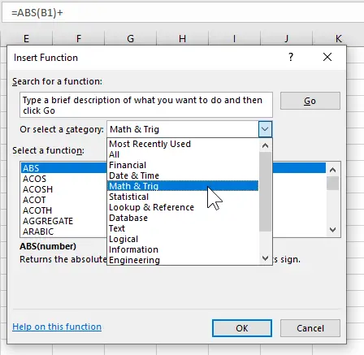

Excel şi Catia V5 au **formule**în comun! Amândouă programele folosesc formule, doar că sunt introduse în mod diferit.

În **Excel**arată cam aşa – da, clar, ştie toată lumea:

În **Catia V5** te poţi folosi tot de formule în loc de numere statice, şi ai multe operaţii la dispoziţie:

Imaginea am luat-o dintr-un articol, în care este menţionat cum poţi citi în VBA distanţa dintre două puncte. Vezi tot articolul în engleză aici: [https://www.scripting4v5.com/additional-articles/how-to-measure-distance-between-two-points-catia-macro/](https://www.scripting4v5.com/additional-articles/how-to-measure-distance-between-two-points-catia-macro/)

Mai este o asemănare între Excel şi Catia V5: amândouă pot fi automatizate folosind **VBA**!

### De ce asemănarea dintre Excel şi Catia V5? De ce articolul acesta?

Dacă înţelegi un program bine, atunci nu mai ai limite. Toate programele cam au aceeaşi bază, la unele mai vizibilă şi uşor de înţeles decât la altele. Doar funcţiile sunt altfel numite, butoanele arată altfel, au mai multe sau mai puţine opţiuni.

Faptul că amândouă, şi Excel şi Catia V5 au legătura la VBA, le face împreună o unealtă extrem de flexibilă. Când te gândeşti că şi SAP suportă VBA, poţi face automatizări fără limită!

### Vrei să ştii de unde să începi cu Catia V5?

Vezi articolul acesta, în care poţi învăţa pas cu pas aşa cum şi eu am învăţat: [https://ionutojica.com/invata-catia-v5-de-la-zero/](https://ionutojica.com/invata-catia-v5-de-la-zero/)
