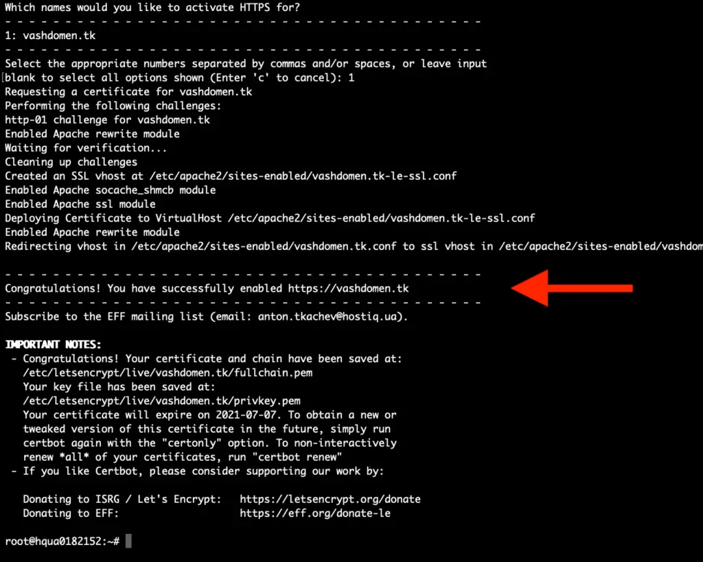

În continuare îţi voi spune paşii cum pot eu să instalez Mautic gata pentru producţie, aceiaşi paşi îi poţi urma şi tu pentru a instala Mautic.

Alex i-a menţionat foarte clar în articolul de aici [[https://hartmut.io/mautic-4-installieren](https://hartmut.io/mautic-4-installieren)] şi-l poţi vedea pe Alex cum rulează aceşti paşi în videoul acesta

### Paşi preliminari ca să instalez Mautic

Este necesar să am un calculator pe care să instalez Mautic. Modul implicit de a-l instala este pe un **VPS (virtual private server)**.

```
Dacă te decizi să iei VPS de la Hetzner, fă-ţi cont la ei prin linkul acesta: https://ionutojica.com/hetzner. Prin acest link primim şi tu şi eu câte 20 euro, din care poţi plăti serverul CX21 timp de 3 luni (CX21 = 2vCPU + 4GB + 40GB + 20TB traffic care costa 5.83e/luna) - practic poţi testa serviciile Hetzner dar şi Mautic timp de 3 luni complet gratuit.
```

Înainte de a instala Mautic pe VPS, ba chiar înainte de a porni VPS-ul, trebuie să securizezi serverul cu un Firewall, prin care să laşi deschise doar acele porturi care vor fi folosite. În cazul nostru deocamdată poţi lăsa deschis doar portul SSH, iar ulterior le vom deschide şi pe http şi https. Şi să adaugi o cheie SSH.

În articolul acesta: [https://ionutojica.com/pornirea-vps-pentru-mautic/](https://ionutojica.com/pornirea-vps-pentru-mautic/) am menţionat pas cu pas ce trebuie de făcut.

Dacă i-ai urmat deja, atunci continuă cu comenzile de mai jos pentru a instala Mautic pe acest VPS.

În continuare menţionez comenzile pe care să le rulezi prin SSH pe server:

### Actualizăm ultimele versiuni ale pachetelor

### Instalăm modulele necesare

Instalăm toate modulele necesare odată folosind comanda:

Notă: acel -y din comenzi are rolul de a instala direct, fără a-ţi mai cere vreo confirmare.

Cele 3 module instalate sunt:

- software-properties-common – cu siguranţă că ai deja ultima versiune instalată
- unzip – vom avea nevoie pentru dezarhivarea Mautic
- python3-certbot-apache – instalează certificatul SSL necesar pentru a accesa Mautic prin https://
- apache2 – serverul web
- mariadb-server şi mariadb-client – baza de date MariaDB

### Securizăm instalarea MySQL

Înlocuieşte **parola_de_la_mysql** printr-o parola puternică, cum ar fi 8RO”)&YwI[k\$MmC*:;5

### Instalăm php 7.4 şi modulele necesare pentru Mautic

Da, a apărut şi php 8.1, Mautic însă nu-l suportă. Deocamdată instalăm php 7.4 . Deoarece pentru Mautic mai este nevoie de unele module extra, le putem instala pe toate odată cu următoarea comandă:

### Schimbăm setările standard ale php

- Extinde limita maximă de memorie folosită de php de la 128Mb la 2Gb

- Extinde mărimea maximă a unui fişier urcat prin php de la 2Mb la 20Mb

- Măreşte timpul maxim de execuţie a unei comenzi până ce va fi întreruptă de php de la 30 de secunde la 6 minute:

- Setează zona de timp Bucureşti pentru timpul folosit de php:

Sau Berlin (cum este în cazul meu):

### Activăm ca serverul web Apache2 sa ruleze la fiecare pornire a VPS

### Repornim serverul web Apache2

### Creăm baza de date pentru Mautic

Vom crea baza de date cu numele ***mautic***, precum şi utilizatorul cu numele **mautic**. Acestea le poţi schimba dacă doreşti. Ce este însă important este să schimbi **parola_bază_de_date** printr-o parolă cu adevărat puternică, cum ar fi ;\RWKm-uuL^.]>uY9}+M

### Instalez Mautic

Pentru ca să instalez Mautic, creăm un dosar în care vor fi fişierele – este bine să numim dosarul pentru Mautic la fel cu subdomeniul folosit. În cazul meu am ales subdomeniul să fie **m** (da, doar litera **m**, care poate veni de la **m**autic sau **m**arketing sau e**m**ail). Asta înseamnă că voi accesa mautic prin url-ul: https://**m**.ionutojica.com .

### Descărcăm arhiva Mautic:

Aici poţi vedea care este ultima versiune eliberată de Mautic, pentru a o descărca:

[https://github.com/mautic/mautic/releases/](https://github.com/mautic/mautic/releases/)

Pentru a descărca ultima versiune, înlocuieşte în următoarele 3 comenzi “4.4.2” cu versiunea actuală.

### Dezarhivăm arhiva în dosarul nou creat:

### Ştergem arhiva:

### Setăm un Host virtual pentru Apache2

Este bine să numeşti fişierul **m.conf** la fel cu subdomeniul folosit. **Nano** este în Linux echivalentul **Notepad** din Windows.

Şi adaugă următorul conţinut, după ce completezi adresa@de_email_a.ta, dosarul unde este instalat Mautic ( în cazul meu /var/www/html/m/ ) şi subdomeniu.domeniu ( în cazul meu m.ionutojica.com ):

În **Nano** dăm click dreapta pentru a lipi textul din clipboard în documentul **m.conf** deschis. Apăsă **Ctrl+S** pentru a salva documentul, după care **Ctrl+X** pentru a ieşi.

### Fiind din nou la consolă, activăm subdomeniul să fie accesat prin Apache2:

### Activăm modulul de suprascriere pe serverul web Apache2

### Şi repornim a doua oară serverul web

### Permiterea http şi https prin Firewall

Dacă foloseşti Firewall la VPS-ul creat, trebuie să te asiguri ca înainte de activarea certificatului SSL să permiţi ca porturile http şi https să fie deschise. Altfel nu va fi posibil să accesezi instalarea Mautic precum şi următorul capitol va returna eroare. Vezi aici cum să extinzi permiterea porturilor http şi https prin Firewall : [https://ionutojica.com/pornirea-vps-pentru-mautic/#firewall_extern](https://ionutojica.com/pornirea-vps-pentru-mautic/#firewall_extern) .

### Activăm certificarea SSL

Modulul **certbot** necesar l-am instalat la început. Actualizează în următoarea comandă adresa@de_email_a.ta pentru ca, dacă la un moment dat certificatul nu va putea fi recreat, să primeşti o înştiinţare pe email. Actualizează şi subdomeniu.domeniu cu al tău.

Apasă **n** şi **Enter** pentru a nu primi Newsletter-ele legate de certificatele SSL (poţi însă să alegi să le primeşti, apăsând **y** în loc de **n**). Apoi ar trebui să fie afişat un mesaj verde de felicitare, arătând că totul e ok, că avem certificatul SSL instalat şi activ:



Dacă însă primeşti un mesaj roşu, care spune că nu a putut fi instalat certificatul, problema poate fi:

- porturile http şi https nu sunt activate în firewall
- configurarea subdomeniului este greşită (verifică în CPanel certificatul A : trebuie să conţină ip-ul serverului)

### Dăm drepturi de scriere pentru Mautic

dacă ai instalat Mautic în alt director, actualizează şi aici acest director ( în cazul meu este /var/www/html/m ):

Felicitări – suntem mai aproape de final cu încă un pas !

### Ce urmează

Acum dacă ştii cum să instalez Mautic pe VPS, urmează finalizarea instalării Mautic, integrarea cum Amazon SES şi apoi personalizarea Mautic prin şabloane de emailuri, formulare şi pagini de lansare.

Pentru moment însă, îmi poţi lăsa un comentariu dacă te-a ajutat acest articol, dacă ai reuşit şi tu să instalezi Mautic?
