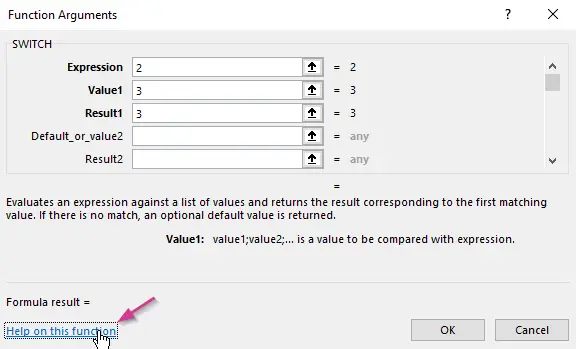
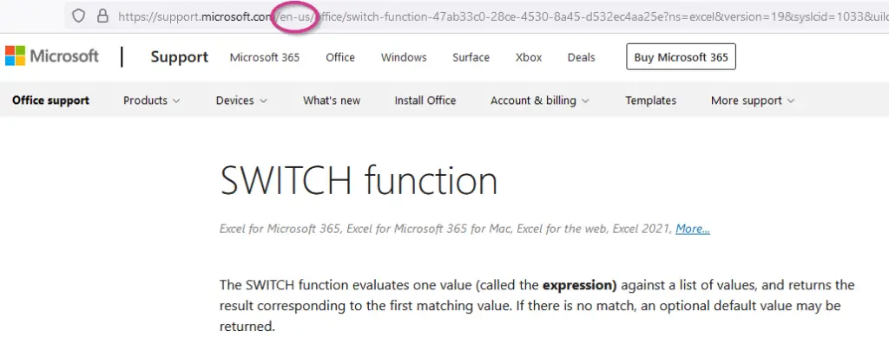
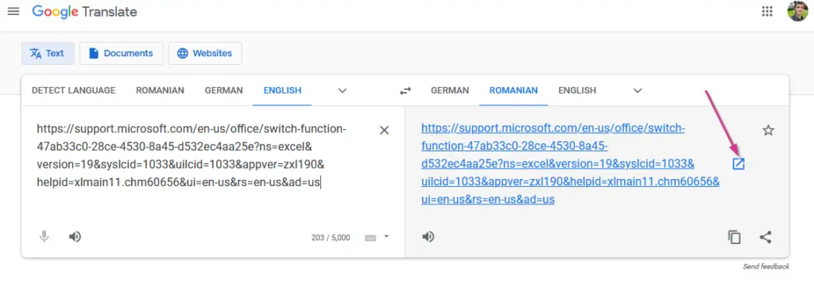
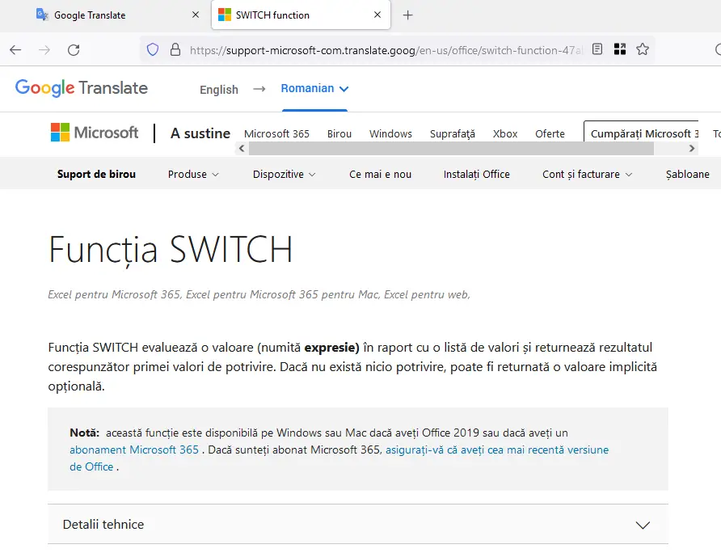

### Cum ar fi fără funcţia dacă … atunci … ?

Ce-ar fi un program în care nu ai avea posibilitatea să faci diferite acţiuni în funcţie de o condiţie !? Dacă … atunci …
Este de neconceput.

Aşa se comportă un calculator de birou – totul trebuie să gândeşti tu: dacă primeşti rezultatul cutare, introduci un calcul sau altul.

### Care este funcţia din Excel pentru dacă … atunci … ?

Echivalentul lui **dacă … atunci …** în Excel este formula **=IF()** cu 3 argumente. Primul argument este condiţia.

- Dacă condiţia este **adevărată**, rezultatul formulei =**IF()** va fi al doilea argument.
- Iar dacă condiţia este **falsă**, rezultatul va fi al treilea argument.

Asta înseamnă că:

- orice ai introduce în primul argument (condiţia) – Excel va încerca să-l transforme ori în adevărat (TRUE) sau în fals (FALSE)

Mai este şi o altă formulă asemănătoare: **=SWITCH()** cu multe argumente. Valoarea primului argument va fi comparată cu al doilea/al patrulea/şamd argument, iar dacă sunt egale atunci rezultatul formulei =**SWITCH()** va fi al treilea argument, sau al cincilea … şamd.

Dar ştii… Microsoft spune tot, aşa că doar te direcţionez spre paginile în română despre formula **=IF()**.

### 1. Noţiuni generale – definiţii, cum se foloseşte şi exemple

### 2. La ce să fii atent când foloseşti IF

mai ales prin exemplele arătate de Microsoft este foarte uşor de înţeles problematica

Aşa-i că este mai mult decât suficientă explicaţia şi chiar de prisos orice completare?
Acum rămâne să pui în practică, să foloseşti cunoştinţele acumulate!

### 3. Cum e cu SWITCH?

Iar dacă doreşti să ştii mai multe despre formula **=SWITCH()**, te provoc să deschizi Excel, să introduci formula **=SWITCH** şi să ajungi la această fereastră:

În colţul din stânga jos apasă pe textul pe care scrie “[Help on this function](https://support.microsoft.com/en-us/office/switch-function-47ab33c0-28ce-4530-8a45-d532ec4aa25e?ns=excel&version=19&syslcid=1033&uilcid=1033&appver=zxl190&helpid=xlmain11.chm60656&ui=en-us&rs=en-us&ad=us)” pentru ca să deschizi în Browserul tău descrierea pregătită de Microsoft pentru această formulă.

De obicei ţi se deschide pagina în limba engleză, dar poţi să o schimbi în română înlocuind în url: /**en-us**/ cu /**ro-ro**/ .
Dar surpriză, pentru formula **=SWITCH()** Microsoft nu a pregătit pagina şi în română, aşa că nu se va întâmpla nimic. O încercare însă merită de obicei, pentru alte formule !

### 4. Cum citeşti pagina în română când nu este disponibilă?

Ce-ai mai putea face ca să citeşti pagina în română atunci când nu e disponibilă, este să traduci pagina cu **google.translate**. Pentru aceasta dai Copy-Paste de la url-ul paginii pe care o doreşti tradusă direct în **google.translate** şi apeşi pe butonul din dreapta:

Rezultatul va fi pagina în română. Traducerea este ca din topor, totuşi dacă nu ştii deloc engleză, te ajută să te lămureşti :

Câteva indicii care sper că-ţi vor folosi nu doar la Excel, ci în tot ceea ce doreşti să realizezi !
