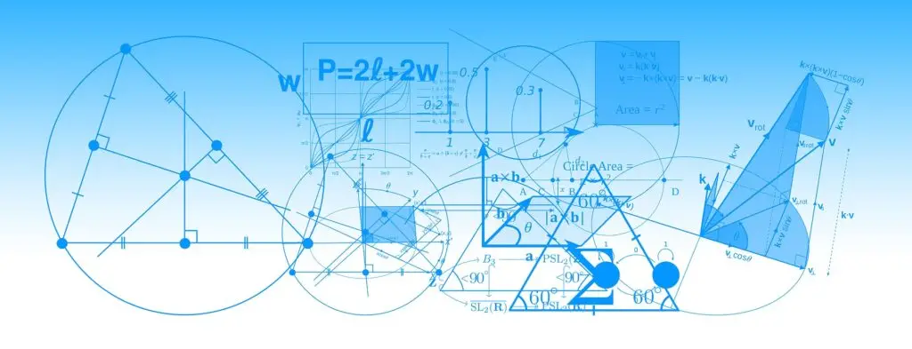

Are cuvântul **funcții**la tine un sens negativ? Este legat de o traumă?

Am mai auzit la unele persoane că din şcoală nu înțeleg **funcții**. Că a trebuit să ştie la mate, dar nu le înțelegea.

Poate că proful ne repezea și, neavând nici metoda de a ne explica, trecea mai departe mulțumindu-se că unul sau doi din clasă înțelegeau. Crezând că și noi la un moment dat vom înțelege.
Totuși sunt unele persoane care au terminat şcoala și cam au căpătat pică pe cuvântul “**funcţii**“, și încă mai păstrează această amintire și o duc cu ei.

O greutate ce nu doare.
Doar câteodată ne aduce aminte… când folosim Excel poate !?

Nu doar la mate se învăţa despre **funcţii**, ci și la fizică tot de **funcții**se vorbea.

Poate sunt momente când erai singur şi te străduiai să înveți la mate pentru bac, și simțeai că e degeaba. Şi nota a și fost doar de trecere, dovedindu-ţi parcă pentru ultima dată, că **funcțiile**sunt un concept pe care tu nu-l poți niciodată înțelege.

### Suntem mulţi care nu înțelegem funcții.

Da, şi eu sunt printre cei care nu înţelegem **funcţii**.

Diferența este că, dacă eu realizez că am uitat integralele şi am nevoie să le folosesc, pentru a le înțelege din nou, va trebui doar să-mi reamintesc citind câteva noțiuni de prin scoală.

Sunt alții care au o repulsie faţă de cuvântul **funcții**, readucându-le în minte și în suflet, retrăind în prezent situațiile negative din şcoală:

- Vreau să învăț, să înțeleg mate, dar nu merge, că tot se folosesc … **funcţii**
- Oricât timp mi-aş lua, tot nu voi înțelege
- Nimeni nu mă poate ajuta: proful nu-şi ia timp, părinţii nu înțeleg, părinţii nu sunt disponibili
- Teme nerezolvate
- Lucrări picate
- Note rele
- Şi toate parcă se concentrau în jurul cuvântului “**funcții**“

### Să fie acesta motivul pentru care în Excel avem FORMULE ?

Firmele mari au grijă să-şi aleagă bine conceptele de bază. Se prea poate că Microsoft a ales să folosească cuvântul **FORMULE**, doar ca să nu trebuiască să rezolve bagajul din jurul cuvântului **FUNCȚII**.

**Formule**în sus, **funcții**în jos, nu are importanţă până la urmă. Contează ceea ce dorești tu să realizezi. Dacă ai nevoie de Excel, atunci este în **funcţie**de tine dacă încerci să scapi de bagajul din trecut !

### Ups, am spus “în funcție de?” Înseamnă că am creat o funcție?

Da. *Am vorbit ca proful de mate?*
Ei, nu chiar, că el vorbea de **funcția**exponențială sau de cea logaritmică.

În orice caz, **în funcţie de** ce exemplu folosea profesorul, tu ai fi putut înțelege, sau nu.

Uite ce **funcție**simplă, cu două rezultate clare, care depind de un singur lucru. Depind de exemplul folosit de profesor:

- Dacă proful lua un exemplu ușor, tu ai fi putut înțelege
- Iar dacă proful lua un exemplu complex, atunci nu ai fi putut înțelege

### Asta e o funcție?

Da.
Atâta tot şi nimic altceva.

> O funcțieeste în funcție de ceva, şi această funcțieare un rezultat care este clar şi bine definit şi depinde de acel ceva.
> IONUŢ OJICĂ

O **funcție**este **în funcție de** ceva, şi această **funcție**are un rezultat care este clar şi bine definit şi depinde de acel ceva.

Ceea ce face mai complicat sunt **tipurile de funcții**.

**Dar asta e deja altceva.**

Poate că nu înțelegi astfel de funcții:

- Exponențială
- Logaritmică
- Integrală
- Derivata de ordinul x
- A lui Pitagora
- A lui Euler
- Factoriale
- Ş.a.m.d.

Asta e altceva. Dacă nu le folosești, nici nu ai nevoie sa le înțelegi !
Deja relaxant ?

Aşa cum şi eu am uitat **funcţia**integrală şi nu simt că-mi lipsește mare lucru că nu o știu, aşa şi tu ai voie să uiţi şi **funcţia**exponenţială şi cea logaritmică…

Când voi avea nevoie de integrală, voi citi despre ea și gata.
Aşa și tu: când vei avea nevoie să ştii despre exponenţială, vei citi și gata.

Sper că am făcut puţină lumină în jurul cuvântului **funcții**. **În funcţie de** asta stă a înțelege sau nu cum funcţionează un calculator, respectiv un program. În cazul nostru Excel.

Excel foloseşte **funcţii**, care la el sunt numite de fapt **formule**.

Ca **formulele**magice din Arabela, sau **formula**minune a spanacului din Popeye marinarul.

**Formule**în sus, **funcţii**în jos, nu contează care din aceste cuvinte sunt folosite. Important este să fim relaxaţi când folosim aceste concepte în Excel.

În Excel trebuie să ne concentrăm pe**modul în care ne folosim** de **formulele**ce ne stau la dispoziţie pentru a obţine ceea ce dorim !
