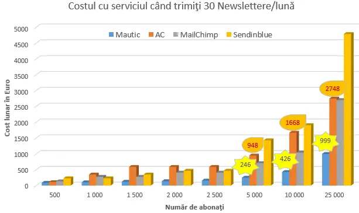

Un motiv important de ce Mautic m-a motivat să schimb Autoresponderul a fost costul ridicol de mic. După care au urmat viteza fulger, faptul că este soluţia finală, are extensii şi integrări multe, editorul de campanii modern, update fac când doresc, este Open-Source.

## Costul ridicol de mic

La început am făcut **greşeala**să cred că Mautic poate fi folosit **direct din hostingul** meu. Asta ar fi însemnat cost **zero**pentru calculatorul pe care rulează programul (că hostingul şi-aşa îl plăteam, deci ar fi fost cumva inclus).

Nu este însă aşa. Mautic poate fi instalat şi folosit din hosting, totuşi, recomandat: doar pentru testare. Sau pentru maxim 5k contacte (dar ce faci peste 5k contacte – tămbălău cu mutatul pe un VPS)

Pentru producţie soluţia finală este un **VPS** din mai multe puncte de vedere. Până la 15k contacte plătesc 5,83€ lunar. Dacă vrei şi tu VPS aşa de ieftin, prin acest link poţi primi **20 euro** pe care-i poţi folosi pentru **testarea VPS**-urilor Hetzner – practic îţi vor ajunge pentru primele 3 luni:[ionutojica.com/hetzner](https://ionutojica.com/hetzner) .

O altă greşeală a fost că am crezut că **primele 62k emailuri** trimise în fiecare lună prin Amazon SES sunt **gratuite**. Dar asta se aplică doar dacă iau VPS de la Amazon (prin serviciul numit EC2). Deoarece la Amazon VPSurile sunt mai scumpe, m-am decis că mai bine plătesc la Amazon SES de la primul email trimis, la tariful de **1€ pentru fiecare 10k** emailuri trimise şi mă folosesc de VPS de la Hetzner.

Considerând şi costurile lunare fixe (pentru abonamentul la VPS) şi cele variabile (trimiterea de email-uri prin Amazon SES) pot spune că folosirea Mautic îmi reduce considerabil costurile pentru acest serviciu! Analizează puţin diagrama de mai jos, care este pentru cel mai nasol posibil scenariu: trimiterea de 30 de Newslettere pe lună la toţi abonaţii (eu n-am ajuns acolo… de-abia dacă trimit un Newsletter pe săptămână)

## Viteza fulger

eu fiind singurul care foloseşte VPS-ul, e normal că nu sunt afectat de alţi utilizatori. Poate că şi poziţia VPS-ului îşi spune cuvântul – am ales Nürnberg; eu locuind în Schwäbisch Hall, sunt 3 rutere între mine şi server: Stuttgart – Frankfurt – Nürnberg.

Ca info: am folosit comanda **tracert m.ionutojica.com** în CommandPrompt-ul din Windows pentru a afla câte rutere sunt între mine şi VPS.

## Soluţia finală

De ce Mautic este singura şi ultima platformă de marketing online? Pentru că **are toate funcţiile**! Odată obişnuit cu programul, ştiu că nu va trebui să-l schimb.

## Extensii multe

posibilitatea deja integrată de a-l extinde prin **pluginuri**, spre exemplu am testat cu succes extensia pentru serviciul Twilio – pentru a trimite SMSuri.

## Nou – fără frică

nu mă tem a învăţa ceva nou, mai ales dacă are **potenţial**.

Pentru a-l instala am învăţat multe: php, cunoştinţele de bash le-am îmbunătăţit, JavaScript, CSS, ce e acela VPS, cum funcţionează un hosting, WooCommerce şi pluginurile WordPress.

Ba chiar e un plus să învăţăm din când în când ceva nou – aşa ne menţinem sănătoşi.

Tu nu trebuie să parcurgi neapărat aceiaşi paşi! Te pot ajuta pentru început să hotărâm **dacă** acest program se potriveşte pentru nevoile tale, după care putem chiar să-l punem în funcţiune, practic. Vrei mai multe informaţii? Programează o şedinţă gratuită apăsând pe butonul de mai jos:

## Open-Source

programul este open-source, ceea ce înseamnă că îl voi putea adapta după cum doresc – şi am tendinţa asta – după un timp de folosire să **optimizez**tot ceea ce folosesc.

## Update la liber

**nu sunt obligat să fac update**! Asta mă scapă de un stres foarte mare:

- pe de o parte: *never change a running system* – niciodată nu schimba un sistem care merge
- poate şi ţie ţi s-a întâmplat să te saturi de atâtea actualizări la Facebook – parcă mereu schimbă câte ceva şi nu mai găsesc funcţiile unde erau acum câteva luni. Sau butonul sau meniul… totul parcă se schimbă de la o zi la alta. Mai puţin Mautic. Aici se schimbă când sunt pregătit.

Legat de Mautic – sunt firme care folosesc în prezent chiar versiunea 2, în momentul în care versiunea curentă este 4 şi din toamna lui 2023 va fi 5.

Asta-mi spune că **nu sunt riscuri mari de securitate**, cum s-a întâmplat cu WordPress la început, ci este vorba doar de optimizări de performanţă sau de noi funcţii. Deci **pot alege când vreau să fac update** şi la ce versiune.

## Editorul de campanii

această unealtă m-a prins. Acesta a fost prima experienţă şi – am fost **impresionat. E super!** Nu mă aşteptam ca un open-source să aibă un astfel de editor, o astfel de unealtă **modernă**!

## Limba germană

Şi nu în ultimul rând, ambii **experţi**de la care am învăţat enorm, **[Joey](https://www.youtube.com/c/JozsefKeller)** şi [**Alex**](https://www.youtube.com/c/AlexHammerschmied) au videouri şi în limba germană – o limbă pe care o cunosc. A fost incredibil să văd că nu este cam nimic pe româneşte despre Mautic.

## 425+ alte Autorespondere

[Aici](https://www.emailvendorselection.com/email-service-provider-list/) găseşti o listă cu alte Autorespondere. Cu ceea ce am menţionat în articol, ştii de ce Mautic este pentru mine singura platformă completă de marketing online.

## Vrei mai multe informaţii?

Ia legătura cu mine şi-ţi pot prezenta mai în detaliu exact ce te interesează. Fă o programare pentru a ne vedea LIVE într-o şedinţă. Apasă pe butonul de mai jos şi alege data şi ora la care putem să vorbim.

Tu vezi şi alte motive de ce Mautic ar fi şi pentru tine platforma ultimă pentru marketing online? Lasă-mi un comentariu.
