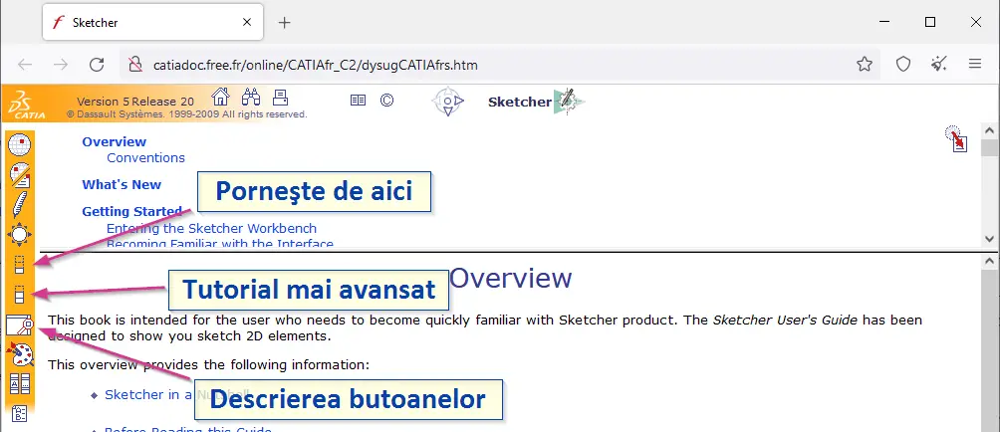

Dacă şi tu eşti autodidact, îţi spun că eu am urmat tutorialele din documentaţia “oficială” care este online aici: [http://catiadoc.free.fr/online/CATIA_P3_default.htm#](http://catiadoc.free.fr/online/CATIA_P3_default.htm#) . În prezent pagina se încarcă foarte greu şi nu pot sări printre module. Din acest motiv am adăugat mai jos şi linkuri directe spre tutorialele la care fac referire.

Tutorialele sunt descrise pas cu pas, pe module bine separate, care pot fi urmărite şi încheiate clar. Chiar dacă sunt în engleză, sunt multe poze şi se păstrează aceiaşi termeni pe care îi găseşti şi în CatiaV5 – ar trebui doar făcând pas cu pas după imagini să reuşeşti cât de cât să parcurgi tutorialele – presupun – ori înveţi engleza chiar parcurgând tutorialele – două păsări dintr-un foc! În orice caz, dacă urmăreşti tutorialele acestea aşa cum îţi voi spune, atunci poţi învăţa Catia V5 de la ZERO în câteva săptămâni, depinde cât timp acorzi pentru asta.

Eu partea cu teoria am sărit-o şi am citit-o doar dacă aveam o întrebare pe parcursul vreunui tutorial. Deci din nou recomand la început învăţarea Catia V5 direct cu tutorialele: întâi cel de bază, apoi cel avansat (la unele module sunt chiar 3 tutoriale în total). La nevoie, când vrei să ştii un anumit buton ce face, te poţi uita în Descrierea butoanelor, cum am arătat în poza de mai jos:

### Învaţă Catia V5 de la zero – paşi

Pentru a învăţa Catia V5 de la zero, recomand parcurgerea modulelor în următoarea ordine. Modulele care nu te interesează şi pe care poţi să le sari, le voi menţiona explicit.

Înainte de a începe efectiv, puţină introducere la Catia V5: în stânga este copacul (unde sunt ansamblele, piesele, operaţiile, parametrii, relaţiile, constrângerile…). În dreapta sus e compasul. Ce mai trebuie să ştii pentru început, este cum te mişti în spaţiu cu ajutorul mausului; la început ţi se poate părea incomod, dar te obişnuieşti repede, fii fără grijă. Fără mouse-3D, Catia cam exasperează toate butoanele mausului, dar şi urechile celor din jur dacă ai un maus … nesilenţios, adică care clicăie tare.

[imagine]**Sketcher** (schiţe 2D, fără volum) – **neapărat primul modul** cu care să începi. Pe acesta se bazează tot restul.
Link direct: [http://catiadoc.free.fr/online/CATIAfr_C2/dysugCATIAfrs.htm](http://catiadoc.free.fr/online/CATIAfr_C2/dysugCATIAfrs.htm)

[imagine]**Part Design** (solide – piese 3D). Modul absolut necesar după Sketcher.
Link direct: [http://catiadoc.free.fr/online/CATIAfr_C2/prtugCATIAfrs.htm](http://catiadoc.free.fr/online/CATIAfr_C2/prtugCATIAfrs.htm)

[imagine] **Generative Shape Design** – **GSD** (forme 3D deschise, fără volum, cum ar fi linii, splines, planuri, suprafeţe complexe) – modulul acesta este super important, **nici să nu te gândeşti să-l sari**, crezând că nu ai nevoie de aşa ceva.
Link direct: [http://catiadoc.free.fr/online/CATIAfr_C2/sdgugCATIAfrs.htm](http://catiadoc.free.fr/online/CATIAfr_C2/sdgugCATIAfrs.htm)

[imagine] (Generative) **Sheetmetal Design** (table – îndoituri cu verificarea prelucrării fără coliziuni) – dacă nu ai în plan să creezi table, atunci poţi sări peste acest modul.
Link direct: Generative Sheetmetal Design: [http://catiadoc.free.fr/online/CATIAfr_C2/smdugCATIAfrs.htm](http://catiadoc.free.fr/online/CATIAfr_C2/smdugCATIAfrs.htm) şi
Sheetmetal Design: [http://catiadoc.free.fr/online/CATIAfr_C2/sheugCATIAfrs.htm](http://catiadoc.free.fr/online/CATIAfr_C2/sheugCATIAfrs.htm)

[imagine] **Assembly** (ansamble – poziţionarea mai multor piese într-unul sau mai multe ansamble) – parcurgerea acestui tutorial este importantă. Unele noţiuni sunt explicate însă în modulul Product Structure, din acest motiv începe cu **Product Structure**, apoi parcurge şi Assembly.
Link direct: Product Structure: [http://catiadoc.free.fr/online/CATIAfr_C2/pstugCATIAfrs.htm](http://catiadoc.free.fr/online/CATIAfr_C2/pstugCATIAfrs.htm) şi
Assembly: [http://catiadoc.free.fr/online/CATIAfr_C2/asmugCATIAfrs.htm](http://catiadoc.free.fr/online/CATIAfr_C2/asmugCATIAfrs.htm)

[imagine] Generative **Drafting** (desene tehnice).
Link direct: [http://catiadoc.free.fr/online/CATIAfr_C2/draugCATIAfrs.htm](http://catiadoc.free.fr/online/CATIAfr_C2/draugCATIAfrs.htm)

[imagine] **DMU Kinematics** Simulator (animaţia şi verificarea mişcării pieselor unui ansamblu) – modulul poate fi învăţat **opţional**, dacă vei dori să faci verificări ale anumitor mişcări de piese, sau analiză de coliziuni în mişcare. Acest modul se bazează pe noţiuni din modulul DMU Navigator, din acest motiv îţi recomand întâi să-l parcurgi pe acesta şi apoi pe DMU Kinematics Simulator.
Link direct: DMU Navigator: [http://catiadoc.free.fr/online/CATIAfr_C2/dmnugCATIAfrs.htm](http://catiadoc.free.fr/online/CATIAfr_C2/dmnugCATIAfrs.htm) şi
DMU Kinematics Simulator: [http://catiadoc.free.fr/online/CATIAfr_C2/kinugCATIAfrs.htm](http://catiadoc.free.fr/online/CATIAfr_C2/kinugCATIAfrs.htm)

[imagine] Generative Structural **Analysis** (analiza de element finit – în ce măsură este solicitată o piesă) – alt modul **opţional**; dacă vei dori să estimezi dacă o anumită piesă mai are puţin până crapă sau dacă poţi să reduci cantitatea de material la jumătate, atunci de acest modul ai nevoie.
Link direct: [http://catiadoc.free.fr/online/CATIAfr_C2/estugCATIAfrs.htm](http://catiadoc.free.fr/online/CATIAfr_C2/estugCATIAfrs.htm)

[imagine] Real Time Rendering – dacă vrei să te joci, e opţional.
Link direct: [http://catiadoc.free.fr/online/CATIAfr_C2/rt1ugCATIAfrs.htm](http://catiadoc.free.fr/online/CATIAfr_C2/rt1ugCATIAfrs.htm)

[imagine] Photo Studio – încă un modul de joacă, tot opţional. Poate acesta îţi va folosi mai mult decât Real Time Rendering – cu Photo Studio poţi realiza poze realiste, simulând lumini şi texturi şi efecte, de care câteodată poţi avea nevoie.
Link direct: [http://catiadoc.free.fr/online/CATIAfr_C2/phsugCATIAfrs.htm](http://catiadoc.free.fr/online/CATIAfr_C2/phsugCATIAfrs.htm)

[imagine] **Prismatic Machining** (simularea de prelucrare prin frezare a unei piese) – vrei să înţelegi cum va fi prelucrată o piesă pe o maşină de frezat? Bineînţeles că poţi extrage şi programul maşină – presupun că sunt puţini cei ce folosesc Catia pentru acest lucru.
Link direct: [http://catiadoc.free.fr/online/CATIAfr_C2/pmgugCATIAfrs.htm](http://catiadoc.free.fr/online/CATIAfr_C2/pmgugCATIAfrs.htm)

[imagine] **Lathe Machining** (simularea de prelucrare prin strunjire a unei piese) – ca mai sus.
Link direct: [http://catiadoc.free.fr/online/CATIAfr_C2/lmgugCATIAfrs.htm](http://catiadoc.free.fr/online/CATIAfr_C2/lmgugCATIAfrs.htm)

[imagine] **STL Rapid Prototyping** (pentru a exporta şi importa fişiere .stl pentru imprimante 3D).
Link direct: [http://catiadoc.free.fr/online/CATIAfr_C2/stlugCATIAfrs.htm](http://catiadoc.free.fr/online/CATIAfr_C2/stlugCATIAfrs.htm)

[imagine] **DMU Knowledge** (parametrizarea avansată a pieselor) – **recomand insistent** şi parcurgerea acestui tutorial ! Aici vei învăţa aspectele adânci ale modelării (în cazul nostru cu Catia, dar trebuie să înţelegi că se aplică la toate programele CAD parametrizate). **Parcurgerea acestor tutoriale, îţi va îmbunătăţi strategia de creare a pieselor.** În orice caz, acest tutorial să-l parcurgi după Sketcher, PartDesign, GSD, Assembly, deoarece se bazează pe aceste module.
Link direct: DMU Knowledge [http://catiadoc.free.fr/online/CATIAfr_C2/kwrugCATIAfrs.htm](http://catiadoc.free.fr/online/CATIAfr_C2/kwrugCATIAfrs.htm) şi 
DMU Knowledge Expert [http://catiadoc.free.fr/online/CATIAfr_C2/kwxugCATIAfrs.htm](http://catiadoc.free.fr/online/CATIAfr_C2/kwxugCATIAfrs.htm)

**VBA** şi **CATScript** – la un moment dat te vei lovi de **automatisme** (aceiaşi paşi pe care trebuie să-i faci de mai multe ori pe zi sau chiar pe oră). Acest modul este pasul următor al înţelegerii relaţiilor. Pentru a parcurge aceste tutoriale, este necesar să fi înţeles cum stă treaba în **DMU Knowledge**. Prin tutorialele de scripting VBA şi CATScript, vei da un **boost de îmbunătăţire a strategiei de creare a pieselor**. Un link la un tutorial de VBA şi CATScript nu am încă – rămâne să adaug când găsesc unul.

### Ce urmează?

Poţi continua apoi cu încă un punct important pe care l-am descris în următorul articol: [https://ionutojica.com/strategia-in-catia-v5/](https://ionutojica.com/strategia-in-catia-v5/)

Se poate să ai întrebări? Scrie-mi într-un comentariu. Voi citi toate comentariile.
