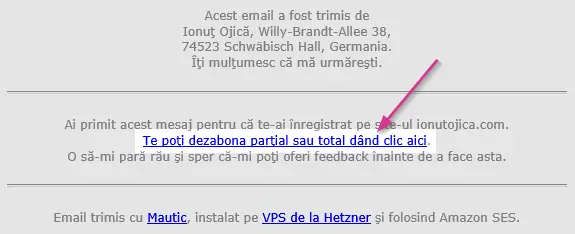
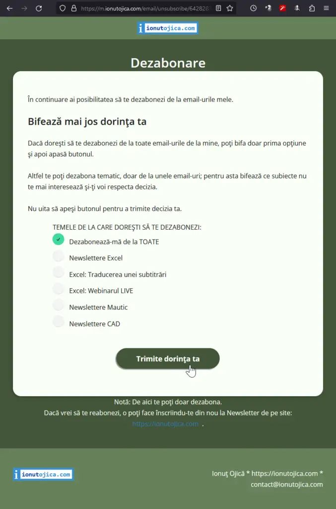

## Am adresa ta de email şi primeşti email-uri de la mine?

Citeşte mai jos să vezi de ce.

Atunci când ai introdus adresa ta de email pentru a primi:

- materialul video gratuit prin care îţi arăt cum am tradus o subtitrare din engleză în română folosindu-mă de Excel
  - pe pagina [https://ionutojica.com/lucrezi-in-excel-cu-usurinta/](https://ionutojica.com/lucrezi-in-excel-cu-usurinta/) (sau înainte de 2022 pe domeniul ionutojica.ro pe care nu-l mai folosesc)
- sau linkul la webinarul gratuit de Excel cu diferite teme pe care le-am dezbătut, cum ar fi: Primii 2 Paşi, Index şi Match, Workshop: optimizarea vitezei de lucru cu un tabel Excel şi altele ca acestea
  - spre exemplu pe pagina [https://ionutojica.com/excel-live/](https://ionutojica.com/excel-live/) (este actualizată doar dacă urmează în curând să susţin webinarul)
- sau direct la Newsletter-ele mele
  - pe pagina [https://ionutojica.com/](https://ionutojica.com/#colophon)

- pe pagina [https://ionutojica.com/lucrezi-in-excel-cu-usurinta/](https://ionutojica.com/lucrezi-in-excel-cu-usurinta/) (sau înainte de 2022 pe domeniul ionutojica.ro pe care nu-l mai folosesc)

- spre exemplu pe pagina [https://ionutojica.com/excel-live/](https://ionutojica.com/excel-live/) (este actualizată doar dacă urmează în curând să susţin webinarul)

- pe pagina [https://ionutojica.com/](https://ionutojica.com/#colophon)

atunci şi doar atunci am primit adresa ta de email pentru a-ţi trimite materialul promis.

## De ce primeşti şi alte email-uri decât cele promise?

În continuare voi face transparent când şi ce email-uri trimit.

### Te-ai abonat la Newsletter-ele mele?

Atunci vei primi pe email:

- informaţii punctuale importante şi valoroase pentru tine
- invitaţie la webinariile gratuite ce urmează să le susţin
- invitaţie la materialele tematice gratuite ce le-am publicat şi la care poţi avea acces
- invitaţie la programele plătite care aduc rezultate într-un timp mai scurt şi au atenţia mea 100% pentru succesul fiecărui participant

De regulă nu trimit newslettere mai des decât unul pe săptămână. Ideea este că îţi trimit newslettere doar când am pregătit ceva valoros pentru tine.

### Te-ai abonat la unul din materialele gratuite?

Atunci vei primi pe email materialul pregătit, aşa cum ţi-am promis.

După trimiterea acestor email-uri, vei primi în continuare Newsletter-ele mele.

Dacă te-ai abonat extra la Newsletter-ele mele, atunci, pe lângă emailurile cu materialul pregătit, vei primi şi Newsletter-ele mele.

### Te-ai abonat la unul din webinariile gratuite?

Atunci vei primi pe email confirmarea de înscriere.

De asemenea vei primi şi unele email-uri de reamintire înainte de webinar. În toate aceste email-uri vei găsi linkul de participare la webinar.

După webinar îţi voi trimite linkul cu înregistrarea webinarului, dacă este disponibilă.

De asemenea îţi voi trimite şi email-uri de reamintire cu ofertă specială oferită în webinar, dacă este cazul.

După trimiterea acestor email-uri, vei primi în continuare Newsletter-ele mele.

## Dezabonare? Aşa:

Îţi respect dorinţa ca la un moment dat să nu mai doreşti să primeşti email-uri de la mine.

Pentru asta, găseşti în subsolul fiecărui email posibilitatea de a te dezabona.

Dă clic pe textul: “Te poţi dezabona parţial sau total dând clic aici.” din email:

Apoi se va deschide pagina de dezabonare în care poţi să alegi preferinţele tale.

Aşa cum am scris şi acolo, dacă doreşti să nu mai primeşti nici un email de la mine, atunci bifează prima opţiune şi apasă butonul de trimitere.

În fereastra de dezabonare ai şi opţiunea de a te dezabona doar de la unele subiecte. Pentru aceasta alege subiectele care nu te mai interesează şi apasă butonul de trimitere.

Notă: dacă te vei abona în viitor pentru un material gratuit sau pentru a participa la un webinar, după aceste email-uri vei fi abonat automat la Newslettere.

## De ce e aşa de important?

*Transparenţa este un bun rar găsit în zilele noastre. Acest articol este un pas în această direcţie.*

De asemenea, pentru mine este important ca să nu marchezi emailurile mele ca SPAM. Atunci când marchezi un email de la mine ca SPAM, te dezabonez automat de la emailuri, dar se mai întâmplă ceva negativ pentru mine. Am detaliat acest lucru într-un articol întreg: [marcarea email-urilor ca SPAM](https://ionutojica.com/marcarea-email-urilor-ca-spam/).

Pentru dezabonare, foloseşte te rog linkul din subsolul oricărui email. Tu vei obţine acelaşi rezultat! Iar eu nu voi avea efecte negative. Şi amândoi vom fi mulţumiţi.
