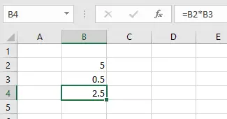
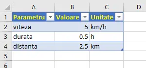

## Cum încep eu un document Excel?

Azi îţi voi spune o poveste. O poveste critică. Poate fi motivator pentru începătorii de Excel.

Presupunem că am o idee simplă şi presupunerea că Excel m-ar putea ajuta.

**Da, doar presupunerea că Excel mă poate ajuta este de ajuns.**

De-abia acum urmează să dovedim concret asta:
Primul lucru este să scriu primul calcul în documentul gol de Excel.

Dar **îl scriu astfel, specific Excel**: într-o celulă scriu un număr, în celula de dedesubt scriu al doilea şi în a treia celulă scriu formula care include operaţia.

Poate mai introduc încă un număr tot cam aşa şi apoi încă una sau două formule.

Când deja am vreo maxim 10 celule cu valori sau formule, îmi pun întrebarea:

> Dar ceam scris în prima celulă? Cereprezintă acel număr?

Dar **ce**am scris în prima celulă? **Ce**reprezintă acel număr?

Şi mai ales îmi pun această întrebare, văzându-mă după jumătate de oră, când am poate 100 sau mai multe celule cu numere => **atunci nu voi mai avea nici o şansă să ştiu imediat ce anume este în fiecare celulă** şi unde aş vrea să modific vreo valoare sau formulă.

Astfel că, dacă am maxim 10 celule, încep să scriu în celula din stânga ei, ce anume reprezintă. Şi tot aşa fac la toate celulele.

Şi apoi, fiind inginer, îmi pun pe bună dreptate întrebarea: bun bun, am un anumit parametru, spre exemplu lungime, în celula cutare. Dar **în ce unitate de măsură este scris?** Să fie metru, milimetru, kilometru?

Şi atunci, după valoarea în sine, mai adaug acolo şi unitatea de măsură. Şi iar: fac asta pentru toate valorile.

Deja având 3 coloane, adaug titlul coloanelor (pe linia goală de deasupra conţinutului), ca spre exemplu: Parametru, Valoare, Unitate, .

> Ca un indiciu util, de regulă încep documentul din B2 să scriu. Bineînţeles că ulterior pot fi adăugate linii şi coloane oriunde, dar oricând vei avea nevoie de titlu, deci linia 2. Şi oricând vei avea nevoie să menţionezi în stânga ce valoare este în dreapta, deci coloana B.

Ca un indiciu util, **de regulă încep documentul din B2** să scriu. Bineînţeles că ulterior pot fi adăugate linii şi coloane oriunde, dar oricând vei avea nevoie de titlu, deci linia 2. Şi oricând vei avea nevoie să menţionezi în stânga ce valoare este în dreapta, deci coloana B.

Aşa-i că până aici deja este super simplu ? Sau poate totuşi nu? Lasă un comentariu mai jos şi spune-mi experienţa ta.

Ce aş mai putea face, gândindu-mă la mine peste 6 luni, ar fi să **mai adaug pe a patra coloană o descriere (opţională)**. Mă va ajuta extrem de mult ulterior, ba chiar şi pe alte persoane care vor vedea tabelul.

Sau mai mult: dacă cumva vor trebui să lucreze cu el! Îţi dai seama ce ajutor vor fi şi aceste comentarii?

Cu siguranţă că şi pe tine te-ar ajuta să primeşti şi un comentariu la fiecare valoare ce o vezi într-un tabel Excel care ţi se oferă să lucrezi cu el.

Şi uite aşa, deja este un boboc care poate înflori.

Dar să revin la **începutul începutului, când tabelul Excel este total gol**. Ce anume a dat început la tot? Repet:

> într-o celulă scriu un număr, în celula de dedesubt scriu al doilea şi în a treia celulă scriu formula care include operaţia.

într-o celulă scriu un număr, în celula de dedesubt scriu al doilea şi în a treia celulă scriu formula care include operaţia.

**Aşa începe şi tu, de la puţin şi simplu, la complex.** Dacă acest început l-ai făcut – următoarele calcule şi rezultate vin de la sine.

Acum te întreb pe tine, cum a fost experienţa ta? Ai avut nevoie vreodată să începi un document Excel de la zero?
