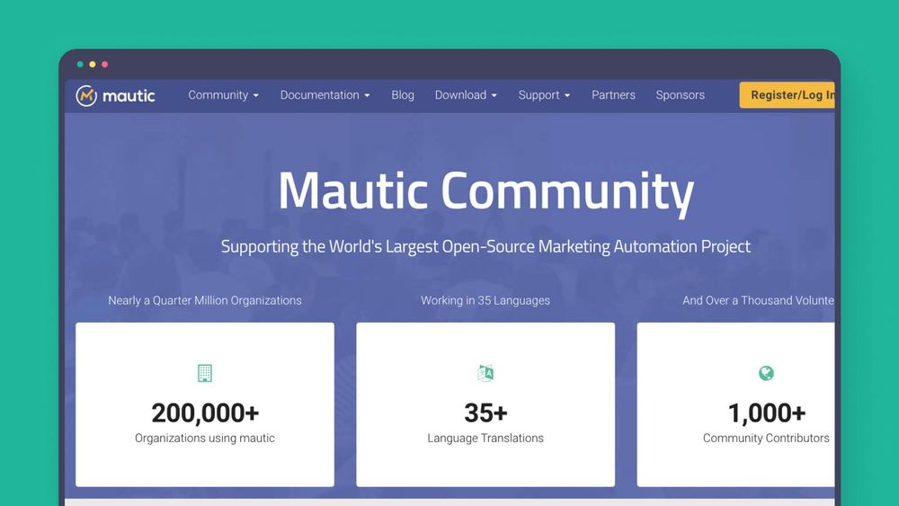
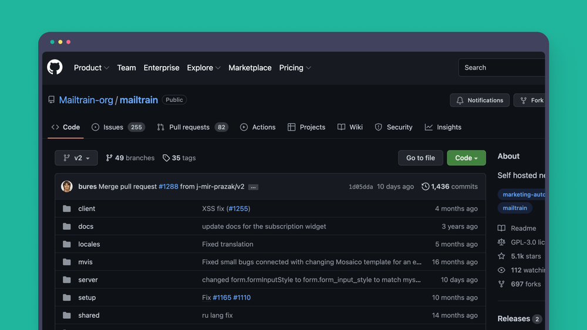
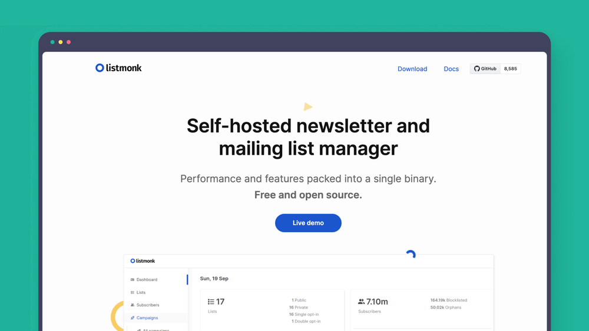
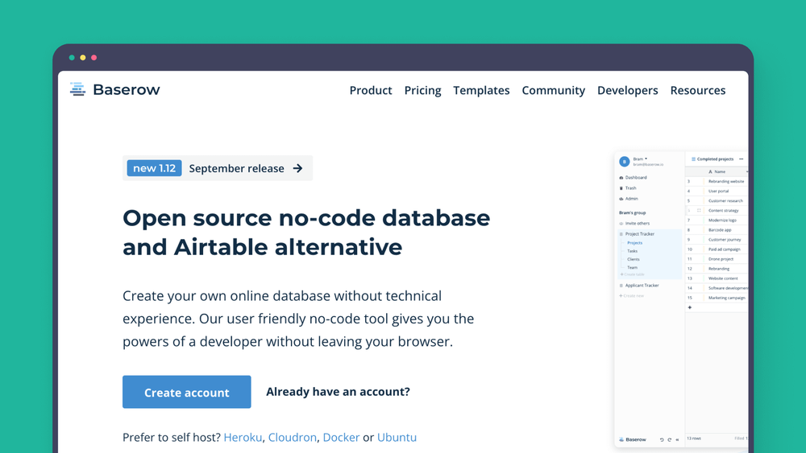
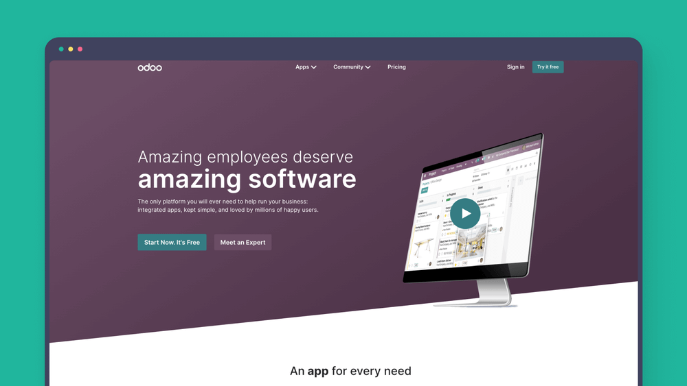
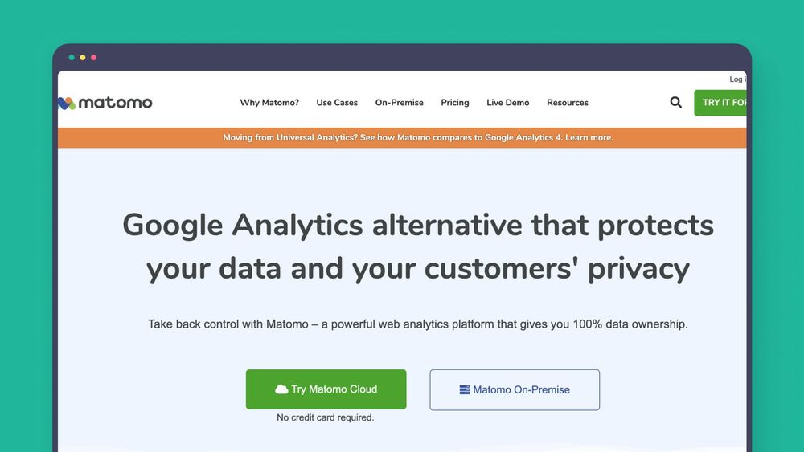
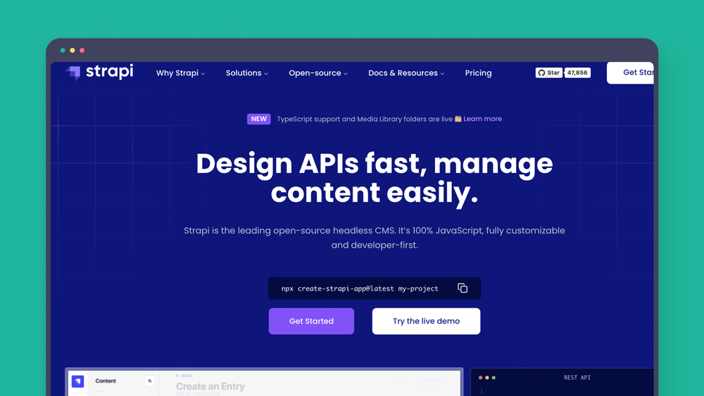
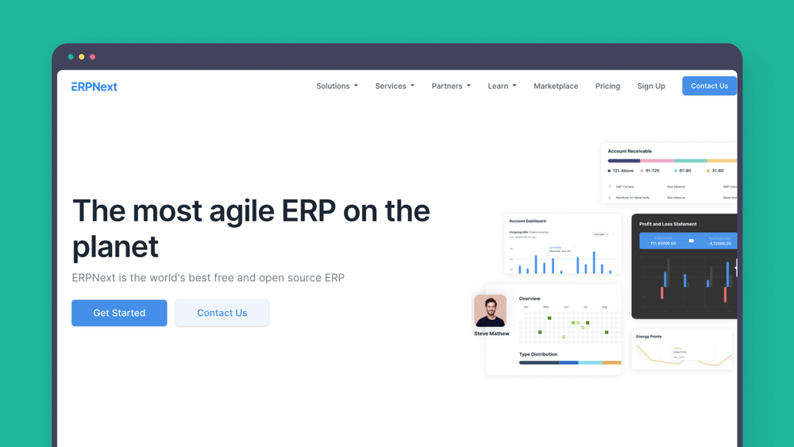

Tocmai am citit următoarea pagină câteva programe open-source gratuite super – în ce priveşte automatizarea marketingului online, eu tot Mautic îl găsesc ok, chiar dacă este încă în dezvoltare şi îi lipseşte unele fundiţe şi năsturei la câteva unelte.

[https://blog.n8n.io/open-source-marketing-automation-tools/](https://blog.n8n.io/open-source-marketing-automation-tools/)

## Mautic

Are următoarele funcţionalităţi:

- trimite emailuri în campanii, sau newslettere la un timp predefinit
- poate ţine contactele în liste
- poţi crea formulare pentru a umple listele sau a începe o campanie
- pagini de lansare – este cam nivel basic, nu te aştepta la Elementor
- poţi adăuga contactelor: etichete (tag-uri), puncte, sau să-i muţi dintr-o etapă în alta (stage)
- poţi conecta cu trimiterea de SMS-uri, notificări Push
- poţi conecta cu n8n – altă unealtă open-source gratuită – prin care poţi conecta cu o mulţime de alte unelte: WordPress, WooCommerce …
- poţi trimite WebHook-uri dar şi primi
- ai evidenţa acţiunilor fiecărui contact
- poate trimite emailuri prin Amazon SES – configurarea în Mautic este foarte uşoară
- campanii cu multe: acţiuni, decizii sau condiţii

Dacă vrei să afli mai multe despre Mautic, am scris câteva articole despre el:

> Care sunt toate funcţiile Mautic – partea 1

> Mautic este GRATUIT pur şi simplu? Care sunt minusurile?

## n8n (Zappier gratuit)

Dacă ştii Zappier, n8n este varianta gratuită ! Este open-source. Eu îl folosesc pentru a trimite date între:

- WooCommerce şi Mautic când un produs este cumpărat, pentru a seta o etichetă contactului şi a porni o campanie de automatizare
- LearnDash LMS şi Mautic pentru a seta etichete când un curs a fost văzut, început sau terminat, pentru a trimite sau nu emailuri de reamintire
- Mautic şi LearnDash LMS pentru a crea userul şi a-i da acces unui curs

Poţi vedea aici cum se foloseşte (este în engleză):

## OpenEMM

Asta ar fi alternativa la Mautic, totuşi găsesc câteva inconveniente:

- la o căutare rapidă, nu ştiu cum poate fi conectat la Amazon SES prin API. Am văzut că poate fi conectat prin SMTP, însă este foarte încet acest serviciu şi pot fi trimise de regulă doar 10 email-uri într-un pachet, pe când prin API pot fi trimise şi 1000.
- nu am văzut să se poată conecta cu n8n

Link: https://www.agnitas.de/en/e-marketing_manager/email-marketing-software-variants/openemm/

## Mailtrain

Alternativa gratuită la MailChimp sau Mautic. Nu l-am testat, aşa că nu pot spune nimic despre el.

Poţi citi mai multe aici: https://github.com/Mailtrain-org/mailtrain

## Listmonk

Alternativa gratuită la MailChimp dar foarte simplă, fără multe funcţii: emailuri, liste, campanii şi statistici. Poate fi extins cu SMS-uri.

Poţi citi mai multe aici: https://listmonk.app/

## Baserow

Un fel de Excel sau Google Sheets – alternativa gratuită la Airtable. Ce-i drept, n-am folosit până acum nici Airtable, nici Baserow. Poate lucra toată echipa odată pe tabel.

Poţi citi mai multe aici: https://baserow.io/

## Odoo

Poţi integra informaţiile din mai multe aplicaţii, creând un singur loc în care introduci datele şi le vezi.

Poţi citi mai multe aici: https://www.odoo.com/

## Matomo

Alternativa gratuită la Google Analytics.

Poţi citi mai multe aici: https://matomo.org/

## Ghost

O unealtă gratuită pentru jurnalişti şi scriitori pentru aşi publica şi promova lucrările. Este clar că nu e pentru mine.

Poţi citi mai multe aici: https://ghost.org/

## Strapi

O alternativă la WordPress, totuşi zic că paginile lor web sunt mai rapide. N-am testat-o până acum – sunt cât de cât mulţumit de WordPress şi trecerea pe alt sistem aduce cu sine şi … lipsă de resurse (mai ales timp) 🙂

Poţi citi mai multe aici: https://strapi.io/

## ERPNext

Este o aplicaţie gigant pentru organizarea afacerii. Oferă servicii pentru: CRM, contabilitate financiară cu integrări la Stripe, Paypal… , constructor de pagini web şi sistem de ajutor online. Poţi trimite facturi, poţi organiza stocul şi comenzile. Pare a fi o unealtă de nota 100 ! N-am testat-o până acum – nu am găsit motivul 🙂

Poţi citi mai multe aici: https://erpnext.com/
