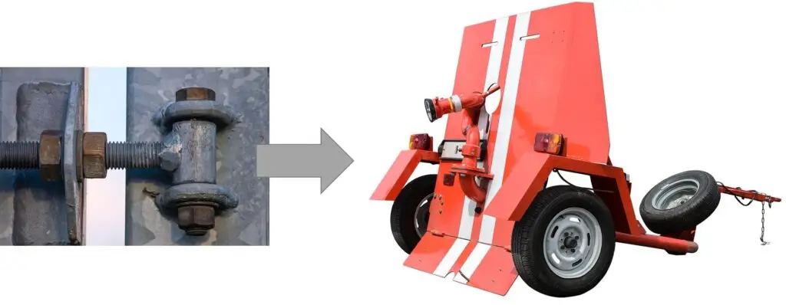

Catia V5 are actual foarte multe posibilităţi, implicit foarte multe module. Chiar şi prin 2003 când am început cu urmărirea primului tutorial, erau destul de multe module care până în 2022 s-au cam dublat.

Dacă ai parcurs [tutorialele din articolul anterior](https://ionutojica.com/invata-catia-v5-de-la-zero/) în ordinea dată acolo, nu ai terminat încă pentru a deveni un modelator bun. Îţi mai lipseşte ceva: **strategia**! Strategia în Catia V5 mi-am însuşit-o prin experienţă – confruntându-mă tot cu alte şi alte provocări.

#### Care este strategia în Catia V5 de a modela o piesă?

Orice piesă poate fi modelată în mai multe moduri. În funcţie de următoarele criterii, voi alege să modelez o piesă într-un mod sau altul:

##### Strategia în Catia V5 pe criteriul: Viteză

Dacă construcţia trebuia să fie ieri gata, atunci nu te mai interesează nici ca schiţele să fie constrânse complet, nici ca să ai constrângerile în ansamblu, ci pur şi simplu foloseşti ori compasul ori Snap pentru a aşeza piesele, sau le construieşti pe toate folosind aceeaşi origine.

Dezavantajul îl vei avea când va fi timpul să modifici, să corectezi. De aceea este totuşi bine să respecţi câteva principii:

- foloseşte cât poţi de mult schiţe simple; mai bine mai multe Pad-uri şi Pocket-uri cu schiţe simple, decât nişte schiţe complicate pe care nu vei mai putea să le dai de capăt.
- cât mai puţine proiecţii şi intersecţii – de fapt cât mai puţine legături între elemente. **Legăturile sunt foarte bune atunci când ai o strategie.** Când viteza este criteriul principal, te vei bucura când va trebui să modifici anumite dimensiuni şi nu vei avea erori … care nu ar trebui să fie, venind din nişte proiecţii şi-aşa invalide.
- adaugă razele şi teşiturile cât mai la final, începând de la cele cu valori mari, la cele mici.
- foloseşte-te cât de mult posibil de funcţiile repetitive, dacă este cazul: oglindire (mirror) sau simetrie (symmetry) în schiţe dar şi în Part, precum şi Patern liniar, circular sau customizat.

Este bine să nu te focusezi pe viteză indiferent ce-ar fi? De regulă în programele de proiectare CAD parametrizate (cum este Catia), vei ajunge în final să fii mai repede gata cu construcţia, dacă nu te axezi pe viteză, ci pe calitate. Inginerii se ocupă majoritatea timpului cu lucrurile care NU merg, şi ei trebuie să le adapteze să meargă. Pentru asta, modelul trebuie să fie construit cu cap, să poată fi modificat uşor. Ce economiseşti azi, poate că mâine pierzi dublu – să nu fie aşa!

O alta metoda de a construi repede este sa creezi toate piesele într-un singur part, fiecare piesă având corpul ei (Body). La final faci atâtea copii ale partului, cate piese sunt şi laşi vizibil în fiecare part doar corpul aferent.

Mai avansat ar fi să transformi corpul aferent în PartBody; pentru asta trebuie sa ai grijă de la început să nu construieşti nimic în PartBody.

##### Strategia în Catia V5 pe criteriul: Flexibilitatea adaptării

În afară de viteză mai sunt şi alte criterii care pot fi cunoscute de la început, cum ar fi flexibilitatea adaptării unei singure dimensiuni, sau chiar crearea mai multor piese de mai multe valori ale unei dimensiuni – cum ar fi lungimea unui şurub. Acest caz este unul simplu şi uşor de implementat – specific unui program de proiectare parametrizat.

O extindere a criteriului anterior este flexibilitatea adaptării complete a dimensiunilor piesei. În acest caz este necesară o strategie bine gândită de modelare a piesei. De regulă în cazul adaptării complete se folosesc următoarele metode:

- multe corpuri simple, cu forme simple, care să poată fi adaptate (“nelimitat”) fără erori. Dacă ar fi să acordăm puncte de la 1 la 100 la toate metodele, acesta ar primi 100 de puncte – este foarte important !
- schiţe simple, cu origini clar definite şi explicit declarate (planurile implicite xy,xz,yz nu sunt folosite). Altă metodă importantă, de 99 de puncte !
- se folosesc elemente proiectate sau intersecţii, doar după elemente explicit publicate:
  - în cazul elementelor din interiorul schiţelor: doar de la elemente “output” (extrase)
  - în cazul elementelor unui corp 3D: doar elemente GSD Extract (parcă aşa se chema)
  - în cazul elementelor GSD: pot fi folosite direct elementele respective
- ca regulă generală: dacă un subelement sau o grupă de subelemente va fi folosită în mai mult de o operaţie, se recomandă crearea unui nou element intermediar (Extract)
- în cazul unui ansamblu, sunt de folosit pentru constrângeri doar elemente publicate
- rotunjirile şi teşiturile se adaugă
  - începând de la cele cu valori mari, la cele cu valori mici
  - la finalul construcţiei
  - nu sunt adăugate în schiţe

- în cazul elementelor din interiorul schiţelor: doar de la elemente “output” (extrase)
- în cazul elementelor unui corp 3D: doar elemente GSD Extract (parcă aşa se chema)
- în cazul elementelor GSD: pot fi folosite direct elementele respective

- începând de la cele cu valori mari, la cele cu valori mici
- la finalul construcţiei
- nu sunt adăugate în schiţe

##### Strategia în Catia V5 pe criteriul: Optimizarea greutăţii

Mai ales pentru piesele printate 3D, **primele forme** pe care le construiesc sunt **ataşamentele** şi toate locurile de legătură cu alte piese sau ansamble. După care adaug umplutura dintre aceste forme. Iar conform cu analiza de element finit, adaptez doar umplutura.

Sau poţi folosi modul **Function Driven Generative Designer (GDE)**, care face umplutura automat: [https://www.cati.com/role/function-driven-generative-designer-gde/](https://www.cati.com/role/function-driven-generative-designer-gde/)
