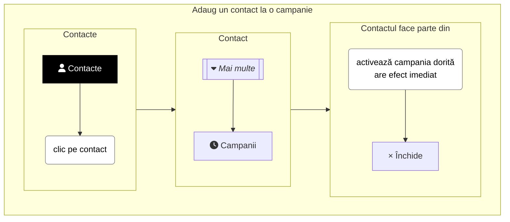
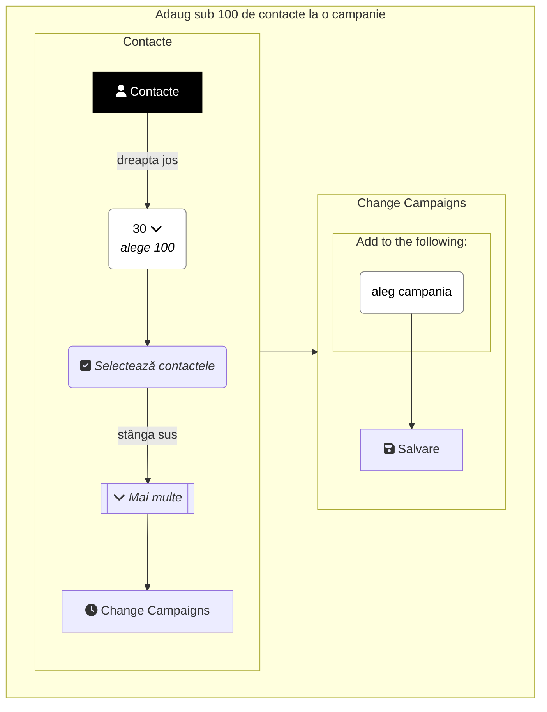
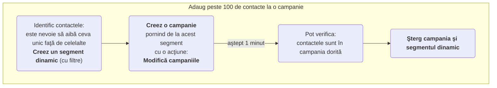

Sunt mai multe metode prin care putem adăuga contacte într-o campanie. În funcţie de numărul de contacte de adăugat.

Împărţeala este din experienţă şi nu-i bătută în cuie. Adică **putem folosi oricare metodă** pentru a adăuga contacte la o campanie!

Dar eficient este:
* Dacă este vorba doar de un contact, atunci metoda 1 este cea potrivită.
* Dacă sunt mai mult de 100 de contacte, atunci metoda 3 este cea potrivită.
* Altfel, atunci când sunt câteva contacte (sub 100), atunci metoda 2 este cea mai rapidă.

## <i class='fas fa-user'></i> 1. Cum adaug un contact la o campanie?
Pentru a adăuga un contact la o campanie, poţi urma paşii de mai jos. De asemenea şi metoda 2 este potrivită.


📺 [Vezi Video](https://www.youtube.com/watch?v=cMppwiTidMc)

## <i class='fas fa-user'></i> 2. Cum adaug mai multe contacte la o campanie?
Pentru a adăuga câteva contacte (sub 100) la un segment static, poţi urma paşii de mai jos.


📺 [Vezi Video](https://www.youtube.com/watch?v=cMppwiTidMc)

## <i class='fas fa-user'></i> 3. Cum adaug foarte multe contacte la o campanie?
Pentru a adăuga foarte multe contacte (peste 100) la o campanie, poţi urma paşii de mai jos:
1. Identific contactele: este nevoie să aibă ceva unic faţă de celelalte. **Creez un segment dinamic**, cu filtre.
1. **Creez o campanie** pornind de la acest segment cu o acţiune: **Modifică campaniile** (las **dezactivată** opţiunea: Contactele să reintre în campanie)
1. Pot verifica: contactele sunt în campania dorită?
1. **Şterg campania şi segmentul dinamic**, să nu se execute din nou.


📺 [Vezi Video](https://www.youtube.com/watch?v=d1i0Dexoksk)
