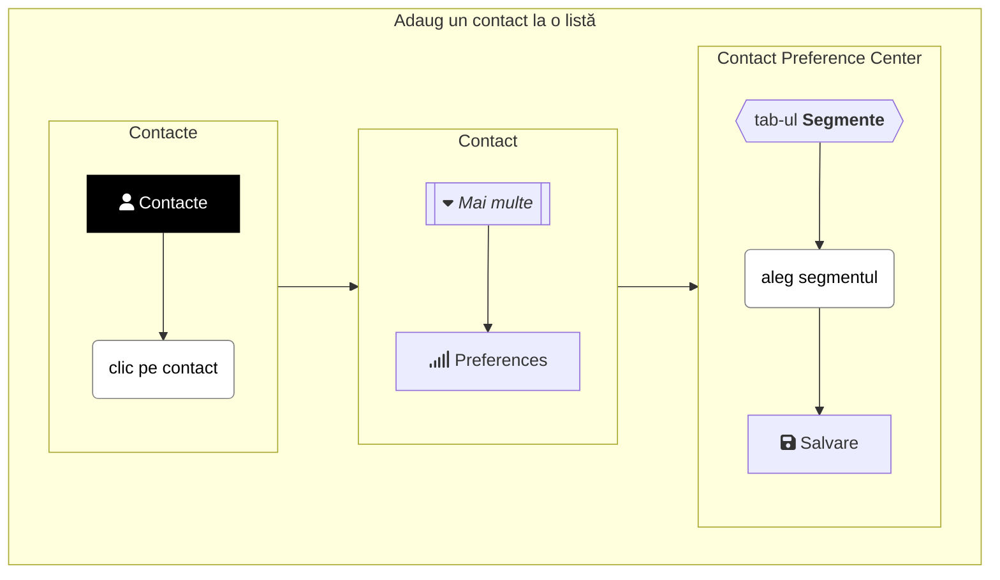
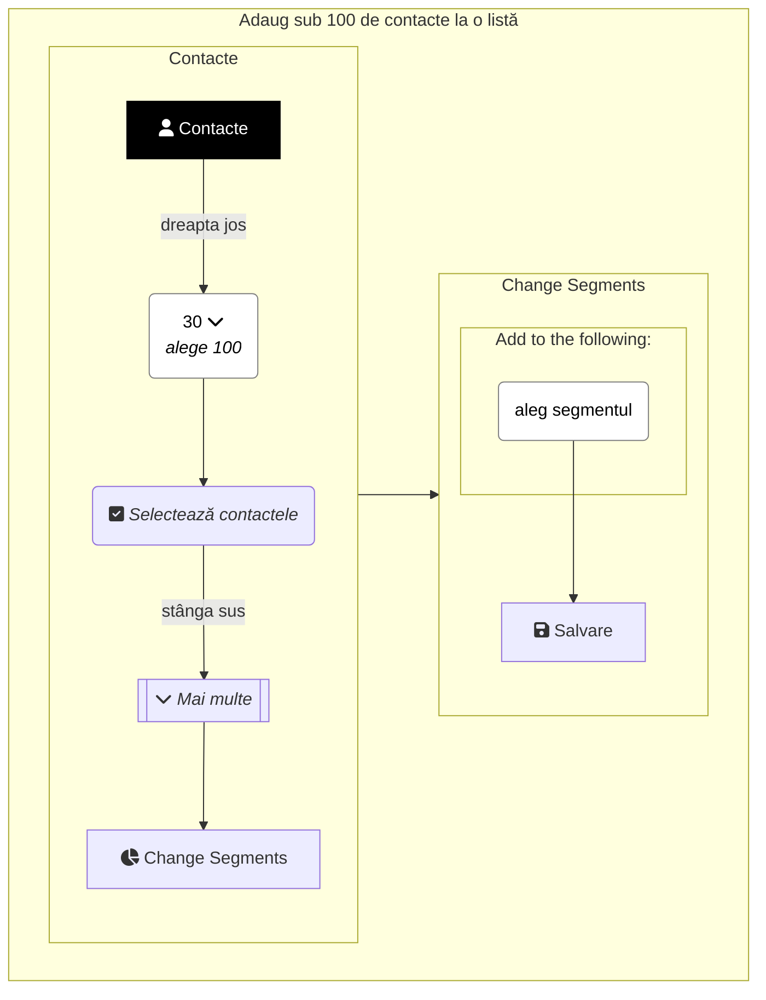
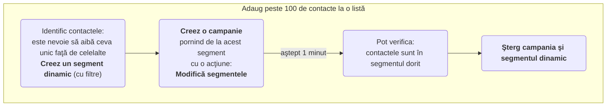

Sunt mai multe metode prin care putem adăuga contacte în segmente statice. În funcţie de numărul de contacte de adăugat.

Împărţeala este din experienţă şi nu-i bătută în cuie. Adică **putem folosi oricare metodă** pentru a adăuga contacte la un segment static!

Dar eficient este:
* Dacă este vorba doar de un contact, atunci metoda 1 este cea potrivită.
* Dacă sunt mai mult de 100 de contacte, atunci metoda 3 este cea potrivită.
* Altfel, atunci când sunt câteva contacte (sub 100), atunci metoda 2 este cea mai rapidă.

## <i class='fas fa-user'></i> 1. Cum adaug un contact la o lista?
Pentru a adăuga un contact la un segment static, poţi urma paşii de mai jos. De asemenea şi metoda 2 este potrivită.


📺 [Vezi Video](https://www.youtube.com/watch?v=IFbLIr2Lr0U)

## <i class='fas fa-user'></i> 2. Cum adaug mai multe contacte la o lista?
Pentru a adăuga câteva contacte (sub 100) la un segment static, poţi urma paşii de mai jos.


📺 [Vezi Video](https://www.youtube.com/watch?v=ryxvsjlocI8)

## <i class='fas fa-user'></i> 3. Cum adaug foarte multe contacte la o lista?
Pentru a adăuga foarte multe contacte (peste 100) la un segment static, poţi urma paşii de mai jos.


📺 [Vezi Video](https://www.youtube.com/watch?v=y6401UKl2F4)

