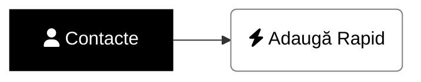
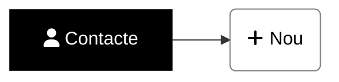

# <i class='fas fa-user'></i> Cum adaug manual un nou contact - modul rapid?
Pasul 1 este să te asiguri că _nu există deja_ un contact cu adresa de email[^caut].



1. Din meniul din stânga alegi ```<i class='fas fa-user'></i> Contacte```
1. Cauţi dacă există deja un contact cu adresa de email: introduci adresa de email şi apeşi tasta ENTER
1. Dacă nu există nici un contact, apasă pe ```<i class='fas fa-bolt'></i> Adaugă Rapid```

    {: w='995' h='370' .shadow .rounded-10 }

1. Completează informaţiile pe care le ai despre contact şi alege ```<i class='fas fa-save'></i> Salvare```

    {: w='583' h='614' .shadow .rounded-10 }

> Să nu dai de capcana ce poate apare când adaugi rapid contacte[^capcana].
{: .prompt-warning }

[//]: # (Comming soon video)


📺 [Vezi Video](https://www.youtube.com/watch?v=LMlCN6_vUvs)

# <i class='fas fa-user'></i> Cum adaug manual un nou contact?
Pasul 1 este să te asiguri că _nu există deja_ un contact cu adresa de email[^caut].



1. Din meniul din stânga alegi ```<i class='fas fa-user'></i> Contacte```
1. Cauţi dacă există deja un contact cu adresa de email: introduci adresa de email şi apeşi tasta ENTER
1. Dacă nu există nici un contact, apasă pe ```<i class='fas fa-plus'></i> Nou```

    {: w='995' h='355' .shadow .rounded-10 }

1. Completează informaţiile pe care le ai despre contact şi alege ```<i class='fas fa-save'></i> Salvează & Închide```

    {: w='1034' h='1228' .shadow .rounded-10 }

> Să nu dai de capcana ce poate apare când adaugi manual contacte[^capcana].
{: .prompt-warning }

[//]: # (Comming soon video)


📺 [Vezi Video](https://www.youtube.com/watch?v=LMlCN6_vUvs)

# Postări relevante
[Cum descopăr care contacte au aceeaşi adresă de email]()

# Note de subsol
[^caut]: [Cum caut contacte]()
[^capcana]: [Capcana când adaug contacte cu aceeaşi adresă de email]()
