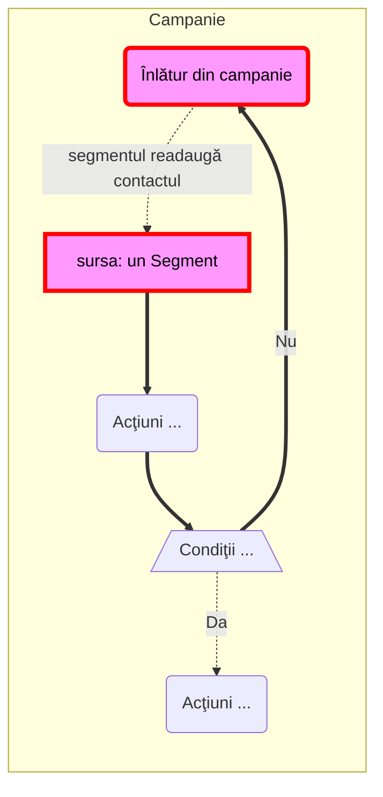
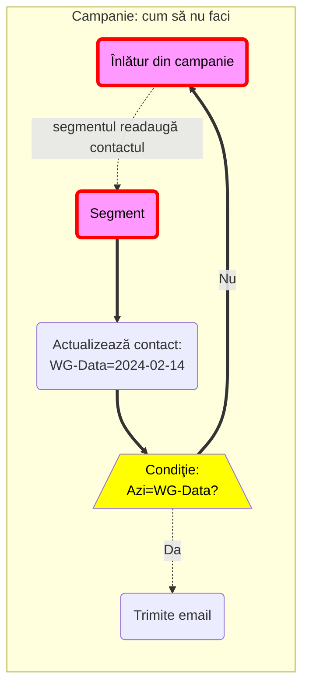
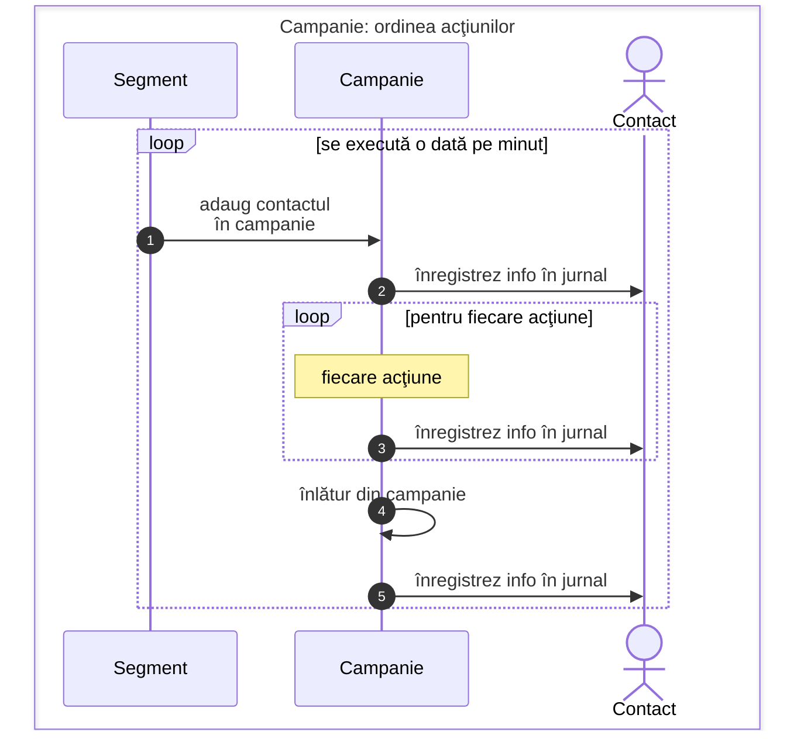

Se aplica atunci când: sursa campania este un segment şi folosesc acţiunea "Înlătur din campania aceasta".

Urmările pot fi nasoale: se măreşte baza de date fără limită. Rezolvarea cea mai simplă şi rapidă este: să reinstalezi o copie de rezervă din ziua în care Mautic funcţiona încă normal.

**Suntem în această situaţie când:**
1. avem o campanie care are ca sursă un segment => pentru fiecare contact care este în segment, va porni şi campania
1. în campanie avem acţiunea "Înlatur din campania aceasta" - DAR contactul fiind încă în segment, contactul va fi adăugat imediat din nou în campanie

Asta este o buclă infinită: contactul este adăugat în campanie, apoi este înlaturat, şi din nou e adăugat în campanie şi tot aşa.

Dacă intre cele 2 acţiuni nu este nici o perioadă de aşteptare, atunci acţiunile acestea se vor executa la fiecare minut.

> Faptul că se execută nu este în sine greşit, ci faptul că toate aceste acţiuni se salvează în istoricul contactului şi al campaniei. În acest fel mărimea bazei de date creşte. Cu cât sunt mai multe contacte în segment, cu atât mai repete creşte baza de date.
{: .prompt-tip }

**Ce s-a întâmplat în cazul meu concret**
* conform unui filtru intrau contactele într-un segment
* în campanie aveam câteva condiţii şi acţiuni
* logica condiţiilor avea un bug, astfel că a fost un moment în care prima condiţie era falsă, şi a doua era tot falsă, şi duceau la acţiunea `Înlatur din campanie`
* şi imediat ce contactul intra în campanie, cele 2 condiţii erau din nou false, astfel că era din nou înlaturat din campanie
* şi contactul, fiind încă în segment, era adăugat din nou la campanie

**Să estimăm mărimea necesară în jurnal pentru evenimentele contactului**
* până la acţiunea `Înlatur din campanie` erau cele 2 condiţii şi vreo 5 alte acţiuni
* în segment erau cam 300 de contacte
* numărul de evenimente pentru fiecare contact: cel puţin 9, adică:
  * adaug în campanie
  * cele 2 condiţii
  * cele 5 acţiuni
  * apoi `Înlătur din campanie`
* numărul de evenimente înregistrate pentru cele 300 de contacte:
  * \$$ 9 evenimente * 300 contacte = 2.700 evenimente / minut $$
  * \$$ 2.700 evenimente / minut = 162K evenimente / ora $$
  * \$$ 162K evenimente / ora = 3.8M evenimente / zi $$
* am observat acest lucru cam după 36 de ore, deci ca. 5.8M evenimente în total adăugate în baza de date
* serverul era ocupat foarte mult cu optimizarea bazei de date. Şi folosea cele 2 CPU ale serverului. Nu mai puteam executa nimic din Mautic.
* rezolvarea a fost: am restabilit o copie de rezervă care avea încă mărimea normală.
* apoi imediat am oprit campania şi am modificat-o pentru a evita situaţia.
* ce am observat: mărimea bazei de date înainte de greşeală: sub 700KB, după executarea campaniei: peste 8MB (adică 8.000KB)

## Efectul este reproductibil. Uite detaliat ce să NU faci
Presupunem această campanie.

Orice contact care intră în segment, va fi adăugat imediat şi în campanie.

Dacă azi nu este `WG-Data` (adică data de 14 februarie 2024), comanda `Înlătur din campanie` va fi executată imediat => contactul va fi scos din campanie.

Înlăturarea din campanie va crea o buclă continuă, care se va repeta la fiecare minut, deoarece contactul a rămas în segment şi segmentul va adăuga contactul din nou în campanie, iar campania va scoate contactul din campanie şi de la capăt:

În exemplul concret, aceste acţiuni se vor executa în oricare alte zile în afară de data de 14 februarie 2024.

Ceea ce se întâmplă de fapt este că jurnalul acţiunilor contactului va creşte în dimensiune, deoarece fiecare acţiune din campanie este salvată în jurnalul contactului.

Dacă este doar un contact, este posibil că nu vei simţi nici o diferenţă de performanţă.

Dar când sunt 400 de contacte, este posibil că vei face lucrul în Mautic imposibil, până ce opreşti campania.

> Ca o comparaţie: este ca şi cum pentru fiecare contact aveai pe o pagină tot istoricul contactului.
> Iar dupa ce contactul rămâne 60 de minute în segment, în afara datei de 14 februarie 2024, ai nevoie de un caiet pentru a păstra istoricul unui singur contact.
{: .prompt-tip }
