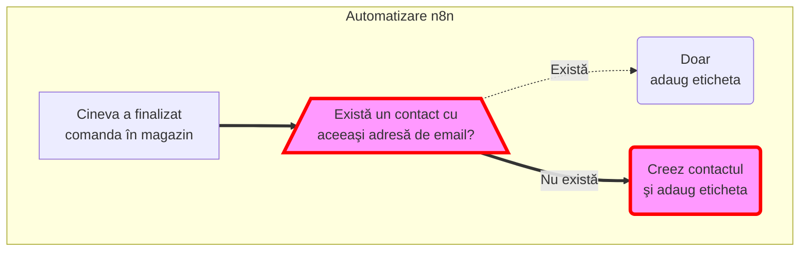

# <i class='fas fa-user'></i> Capcana când adaug contacte cu aceeaşi adresă de email

Se aplică atunci când: **adăugăm manual un contact**.

Contactele adăugate prin formulare nu se vor duplica.

## Manual însă putem să creăm mai multe contacte cu aceeaşi adresă de email

Mautic ne va atenţiona de acest lucru, dar ne va lăsa totuşi să creăm contactul.

> Evită să adaugi încă un contact cu o adresă de email care există deja în baza de date! Pot apare probleme la actualizarea Segmentelor cu anumite filtre.
{: .prompt-tip }

Ce s-a întâmplat în cazul meu concret, în care erau 2 contacte cu aceeaşi adresă de email:
* funcţia de actualizare a segmentelor pentru segmentul cu un anumit filtru a intrat într-o execuţie infinită
* asta a însemnat că alte acţiuni nu se mai executau (procesarea campaniilor, trimiterea emailurilor...)
Rezolvare: am şters unul din contacte şi funcţia s-a executat cu succes. Nu a fost nevoie să fac altceva.

[//]: # (Comming soon video)


📺 [Vezi Video](https://www.youtube.com/watch?v=LMlCN6_vUvs)

## Prin API putem să creăm mai multe contacte cu aceeaşi adresă de email
De API se folosesc Zappier, n8n sau alte platforme de interconectare a diferite servicii.

Eu mă folosesc de n8n pentru a lega magazinul online WooCommerce de Mautic: numele produsului cumpărat în magazin îl adaug la contactul din Mautic ca o etichetă. Automatizarea arată ceva de genul:

* când cineva a finalizat comanda în magazin
* caut întâi dacă există un contact cu adresa de email de pe care s-a făcut comanda
* dacă există, atunci doar actualizez contactul existent, adăugându-i eticheta
* dacă nu există, atunci **creez** contactul şi adaug eticheta

În acest fel sunt sigur că nu se pot crea contacte cu aceeaşi adresă de email.

Legat de acest subiect, pe forumul Mautic este un caz în care este vorba de o bază de date de milioane de contacte şi 12 sunt duplicate. [Poţi citi toată istoria aici.](https://forum.mautic.org/t/how-did-happened-duplicate-contact/24575)

# Postări relevante
[Cum descopăr care contacte au aceeaşi adresă de email]()
[Cum caut contacte]()
